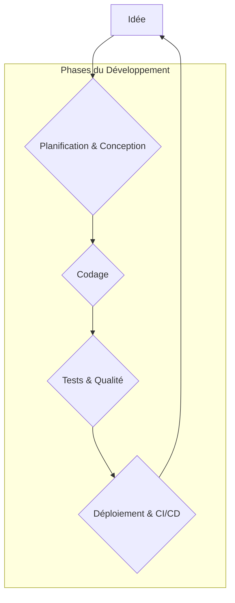
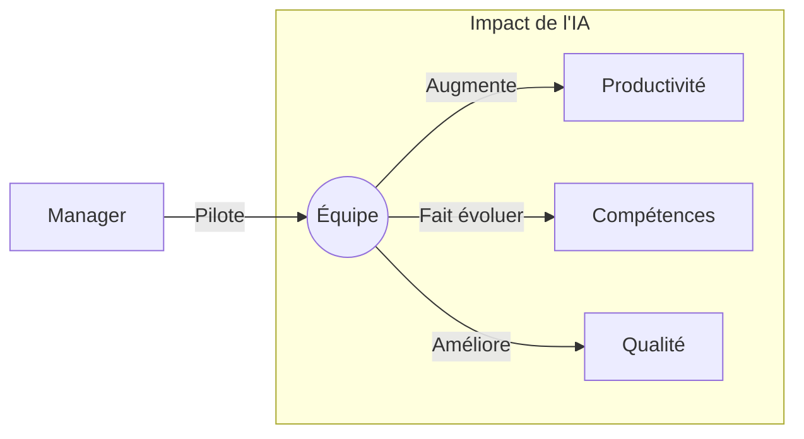

# 📖 Guide Pratique : Intégrer l'IA dans le Quotidien du Développeur et du Manager

---

## 📜 Table des Matières

*   [**Partie 1 : 👨‍💻 Le Parcours du Développeur**](#partie-1--le-parcours-du-développeur---devenir-un-développeur-augmenté)
    *   [Chapitre 1 : Tutoriel - Préparer son Cockpit de Développement](#chapitre-1--tutoriel---préparer-son-cockpit-de-développement-assisté-par-ia)
    *   [Chapitre 2 : L'IA dans Chaque Phase du Développement](#chapitre-2--lia-dans-chaque-phase-du-développement)
    *   [Chapitre 3 : L'Art du Dialogue avec l'IA](#chapitre-3--lart-du-dialogue-avec-lia--le-prompt-engineering)
    *   [Cas Pratique : Créer une API de Tâches avec FastAPI et l'IA](#cas-pratique--créer-une-api-de-tâches-avec-fastapi-et-lia)
*   [**Partie 2 : 👔 Le Parcours du Manager**](#partie-2--le-parcours-du-manager---piloter-la-performance-à-lère-de-lia)
    *   [Chapitre 1 : Comprendre les Enjeux Stratégiques](#chapitre-1--comprendre-les-enjeux-stratégiques)
    *   [Chapitre 2 : Définir une Stratégie d'Adoption Claire](#chapitre-2--définir-une-stratégie-dadoption-claire)
    *   [Chapitre 3 : Garantir la Qualité et la Sécurité](#chapitre-3--garantir-la-qualité-et-la-sécurité)
*   [**Conclusion**](#conclusion)
*   [**Annexes**](#annexes)
    *   [Foire Aux Questions (FAQ)](#foire-aux-questions-faq)
    *   [Glossaire](#glossaire)
    *   [Sources & Inspiration](#sources--inspiration)

---

## 🚀 Introduction

*   **Objectif :** Démystifier l'IA et fournir un cadre d'adoption pratique.
*   **Inspiration :** Ce guide s'inspire de la vision pragmatique et efficace de la chaîne YouTube **[Alex so yes](https://www.youtube.com/@alexsoyes)**.
*   **Structure :** Deux parcours complémentaires pour une adoption réussie à tous les niveaux.

---

## **Partie 1 : 👨‍💻 Le Parcours du Développeur - Devenir un "Développeur Augmenté"**

---

### **Chapitre 1 : Tutoriel - Préparer son Cockpit de Développement Assisté par IA**

Ce chapitre vous guide pas à pas pour installer et configurer votre premier outil d'assistance IA.

**Étape 1 : Installer Visual Studio Code**
*   Téléchargez et installez [VS Code](https://code.visualstudio.com/), un éditeur de code moderne et gratuit.

**Étape 2 : Obtenir une licence GitHub Copilot**
*   Rendez-vous sur la [page de GitHub Copilot](https://github.com/features/copilot) et souscrivez à un abonnement (un essai gratuit est souvent disponible).

**Étape 3 : Installer l'extension dans VS Code**
1.  Ouvrez VS Code.
2.  Allez dans l'onglet "Extensions" (icône de carrés sur la gauche).
3.  Recherchez "GitHub Copilot".
4.  Cliquez sur "Installer".

**Étape 4 : Lier votre compte GitHub**
*   Une fois l'installation terminée, une notification apparaîtra pour vous connecter à GitHub. Suivez les instructions pour autoriser l'extension.

**Étape 5 : Tester votre installation**
*   Ouvrez un nouveau fichier (par exemple, `test.py`).
*   Écrivez un commentaire décrivant une fonction, par exemple :
    ```python
    # Fonction qui prend deux nombres et retourne leur somme
    ```
*   Copilot devrait automatiquement vous suggérer le code de la fonction. Appuyez sur `Tab` pour l'accepter.

---

#### **📌 Points Clés du Chapitre 1**
*   L'installation est simple et rapide via les extensions de votre IDE.
*   La configuration de base est souvent suffisante pour commencer à être productif.

---

### **Chapitre 2 : L'IA dans Chaque Phase du Développement**



*   **De l'idée au code : Planification et Conception** 📝
    *   **Brainstorming :** Utilisez ChatGPT ou Claude pour explorer des idées de fonctionnalités.
    *   **Architecture :** Générez des diagrammes (Mermaid, PlantUML) à partir de descriptions textuelles.
*   **Écrire du code plus vite et mieux** ⚡
    *   **Génération de code :** Créez des fonctions et des classes complètes.
    *   **Refactoring assisté :** Simplifiez et optimisez le code existant.
    *   **Débogage :** Analysez les erreurs et obtenez des solutions.
*   **Assurer la qualité : Tests et Documentation** ✅
    *   **Tests unitaires :** Générez des tests pour vos fonctions, y compris les cas limites.
    *   **Documentation :** Rédigez automatiquement les docstrings et les README.

---

#### **📌 Points Clés du Chapitre 2**
*   L'IA est un partenaire à chaque étape du cycle de vie logiciel.
*   L'automatisation des tâches répétitives libère du temps pour la créativité.

---

### **Chapitre 3 : L'Art du Dialogue avec l'IA : Le Prompt Engineering**

*   **Les fondamentaux d'un prompt efficace** 🗣️
    *   **Clarté et Contexte :** Soyez précis.
    *   **Définir un Rôle :** "Agis comme un expert en sécurité..."
    *   **Fournir des Exemples :** Guidez l'IA avec des exemples concrets.
*   **Créer sa bibliothèque de prompts** 📚
    *   Sauvegardez vos meilleurs prompts dans un outil comme [Notion](https://www.notion.so).

---

#### **📌 Points Clés du Chapitre 3**
*   La qualité de la réponse de l'IA dépend directement de la qualité de votre prompt.
*   Le prompt engineering est une compétence qui se développe avec la pratique.

---

### **Cas Pratique : Créer une API de Tâches avec FastAPI et l'IA**

**Objectif :** Créer une API simple pour gérer une liste de tâches, en utilisant l'IA à chaque étape.

**Étape 1 : Générer le modèle de données (Pydantic)**
> **Prompt :** "Agis comme un expert FastAPI. Génère un modèle Pydantic pour une tâche (Task) avec un id (UUID), un titre (string), une description (string, optionnelle) et un statut 'complété' (booléen, par défaut à false)."

**Étape 2 : Générer les endpoints de l'API**
> **Prompt :** "Maintenant, génère le code pour une API FastAPI qui utilise ce modèle. Je veux des endpoints pour : créer une tâche, lire toutes les tâches, et marquer une tâche comme complétée."

**Étape 3 : Générer les tests unitaires**
> **Prompt :** "Écris les tests unitaires avec pytest et httpx pour l'endpoint de création de tâche. Assure-toi de tester le cas de succès (statut 200) et le cas où le titre est manquant (statut 422)."

**Étape 4 : Générer la documentation**
> **Prompt :** "Génère la documentation pour la fonction de création de tâche au format docstring de Google."

---

#### **📌 Points Clés du Cas Pratique**
*   L'IA peut générer du code cohérent sur plusieurs étapes.
*   Un bon prompt initial (définir le rôle) améliore la qualité de toutes les réponses suivantes.

---

## **Partie 2 : 👔 Le Parcours du Manager - Piloter la Performance à l'Ère de l'IA**

---

### **Chapitre 1 : Comprendre les Enjeux Stratégiques**



*   **Le nouveau visage de la productivité** 🚀
    *   **Nature du travail :** Moins de tâches répétitives, plus de conception et de résolution de problèmes.
    *   **Estimations :** Baser les estimations sur la complexité plutôt que sur le temps.
*   **L'évolution des compétences et des rôles** 🧑‍🏫
    *   **Le "Développeur Augmenté" :** Une évolution du rôle, pas un remplacement.
    *   **Compétences clés :** Prompt engineering, esprit critique, validation de code.

---

#### **📌 Points Clés du Chapitre 1**
*   L'IA transforme la productivité et fait évoluer les compétences nécessaires.
*   Le rôle du manager est de piloter ce changement de manière stratégique.

---

### **Chapitre 2 : Définir une Stratégie d'Adoption Claire**

*   **Fixer des objectifs mesurables (KPIs)** 🎯
    *   **Qualité :** Moins de bugs, meilleure couverture de test.
    *   **Productivité :** Réduction du temps de cycle, plus de déploiements.
    *   **Satisfaction :** Mesurer l'impact sur le bien-être de l'équipe.
*   **Choisir les outils pour l'équipe** 🛠️
    *   **Pilotes et PoC :** Testez avant de déployer à grande échelle.
    *   **Sécurité :** Assurez-vous que votre code ne fuite pas.
*   **Accompagner le changement** 🤝
    *   **Communication :** Expliquez le "pourquoi".
    *   **Formation :** Organisez des ateliers de "pair prompting".

---

#### **📌 Points Clés du Chapitre 2**
*   Une stratégie d'adoption claire est essentielle pour maximiser le retour sur investissement.
*   L'accompagnement humain est la clé du succès de l'adoption des outils.

---

### **Chapitre 3 : Garantir la Qualité et la Sécurité**

*   **Ne pas faire une confiance aveugle à l'IA** 👀
    *   Le code de l'IA doit être relu, testé et validé comme celui d'un développeur junior.
    *   La revue de code est plus importante que jamais.
*   **Mettre en place des garde-fous** 🛡️
    *   **Analyseurs de code statique :** Intégrez SonarQube ou Snyk dans votre CI/CD.

---

#### **📌 Points Clés du Chapitre 3**
*   La qualité et la sécurité ne sont pas négociables.
*   Mettez en place des processus pour valider le code généré par l'IA.

---

## **Conclusion** 🎉

*   L'IA est un marathon, pas un sprint. Adoptez une approche itérative.
*   La collaboration homme-machine est la nouvelle frontière. Soyez-en les pionniers.

---

## **Annexes**

---

### **Foire Aux Questions (FAQ)**

*   **L'IA va-t-elle remplacer les développeurs ?**
    > Non, elle les "augmente". L'IA excelle dans les tâches répétitives, mais la compréhension du besoin métier, la conception d'architectures complexes et la pensée critique restent des compétences humaines irremplaçables.

*   **Comment garantir la sécurité et la confidentialité de mon code ?**
    > Choisissez des outils conçus pour les entreprises (comme GitHub Copilot for Business ou Tabnine Enterprise) qui garantissent que votre code n'est pas utilisé pour entraîner les modèles publics. Ne soumettez jamais de données sensibles (clés d'API, mots de passe) à une IA publique.

*   **Quel est le budget à prévoir ?**
    > Le coût varie. GitHub Copilot coûte environ 10-20$ par mois par utilisateur. Les solutions d'entreprise peuvent avoir des tarifs différents. Considérez cela comme un investissement dans la productivité.

*   **Le code généré par l'IA est-il libre de droits ?**
    > C'est une zone juridique encore floue. La plupart des fournisseurs (comme GitHub) affirment que vous êtes propriétaire du code que vous écrivez, y compris les suggestions que vous acceptez. Cependant, il est de votre responsabilité de vous assurer que le code ne viole pas de licences existantes.

---

### **Glossaire** 📖

*   **IA (Intelligence Artificielle) :** Simulation de l'intelligence humaine par des machines.
*   **LLM (Large Language Model) :** Modèle d'IA entraîné sur d'immenses corpus de texte.
*   **Prompt Engineering :** L'art de formuler des instructions pour une IA.
*   **Hallucination de l'IA :** Tendance des LLMs à générer des informations fausses mais plausibles.
*   **Code Boilerplate :** Code répétitif nécessaire mais peu créatif.
*   **Base de données vectorielle :** Base de données optimisée pour la recherche de similarité, souvent utilisée avec les LLMs.

---

### **Sources & Inspiration** 🔗

*   **Inspiration principale :** La vision et le contenu de la chaîne YouTube **[Alex so yes](https://www.youtube.com/@alexsoyes)**.
*   **Outils & Plateformes :** [GitHub Copilot](https://github.com/features/copilot), [Tabnine](https://www.tabnine.com/), etc.
*   **Articles de référence :** (Liens à ajouter)