# 📖 Guide Complet : L'IA dans le Développement Logiciel

**Guide pratique pour développeurs et managers**

---

## 🎯 À qui s'adresse ce guide ?


### 📌 Guide de lecture

| Profil | Sections recommandées | Temps de lecture |
|--------|----------------------|------------------|
| **👨‍💻 Développeur** | Introduction + Partie 1 complète + Cas Pratiques | 45 min |
| **👔 Manager/Lead** | Introduction + Partie 2 complète | 30 min |
| **🎓 Tech Lead** | Guide complet | 1h15 |
| **🚀 CTO/Direction** | Introduction + Partie 2 Chapitre 1-2 | 20 min |

---

## 📜 Table des Matières

*   [Introduction](#introduction)
*   [**Partie 1 : 👨‍💻 Le Parcours du Développeur**](#partie-1--le-parcours-du-développeur---devenir-un-développeur-augmenté)
    *   [Chapitre 1 : Installer son Environnement IA](#chapitre-1--installer-son-environnement-ia)
    *   [Chapitre 2 : L'IA dans le Cycle de Développement](#chapitre-2--lia-dans-le-cycle-de-développement)
    *   [Chapitre 3 : Maîtriser le Prompt Engineering](#chapitre-3--maîtriser-le-prompt-engineering)
    *   [Chapitre 4 : Cas Pratiques Détaillés](#chapitre-4--cas-pratiques-détaillés)
*   [**Partie 2 : 👔 Le Parcours du Manager**](#partie-2--le-parcours-du-manager---piloter-la-transformation-ia)
    *   [Chapitre 1 : Comprendre l'Impact de l'IA](#chapitre-1--comprendre-limpact-de-lia)
    *   [Chapitre 2 : Définir sa Stratégie d'Adoption](#chapitre-2--définir-sa-stratégie-dadoption)
    *   [Chapitre 3 : Mesurer et Garantir la Qualité](#chapitre-3--mesurer-et-garantir-la-qualité)
    *   [Chapitre 4 : Gérer le Changement](#chapitre-4--gérer-le-changement)
*   [Conclusion](#conclusion)
*   [Annexes](#annexes)

---

## 🚀 Introduction

### Pourquoi ce guide ?

L'intelligence artificielle transforme radicalement le développement logiciel. Ce guide vous aide à naviguer cette transformation, que vous soyez :

- **Développeur** cherchant à augmenter sa productivité
- **Manager** voulant piloter l'adoption de l'IA dans son équipe

### Notre approche


### Les 3 principes fondamentaux

1. **L'IA augmente, ne remplace pas** : Les développeurs restent maîtres du code
2. **La qualité avant la vitesse** : L'IA accélère mais ne compromet pas la qualité
3. **L'apprentissage continu** : L'IA évolue, nous aussi

---

## **Partie 1 : 👨‍💻 Le Parcours du Développeur - Devenir un "Développeur Augmenté"**

> **🎯 Objectif de cette partie :** Vous rendre opérationnel avec les outils IA en 1 semaine

---

### **Chapitre 1 : Installer son Environnement IA**

#### 🎯 Objectif du chapitre

Installer et configurer votre premier outil d'assistance IA en moins de 30 minutes.

#### 📋 Checklist de départ


#### 🛠️ Installation pas à pas

##### **Option 1 : GitHub Copilot (Recommandé pour débutants)**

**Étape 1 : Installer Visual Studio Code**

1. Allez sur [https://code.visualstudio.com/](https://code.visualstudio.com/)
2. Téléchargez la version pour votre OS
3. Installez et lancez VS Code

**Étape 2 : Souscrire à GitHub Copilot**

1. Visitez [https://github.com/features/copilot](https://github.com/features/copilot)
2. Cliquez sur "Start my free trial" (essai gratuit 30 jours)
3. Suivez le processus de paiement (~10€/mois après l'essai)

**Étape 3 : Installer l'extension**

1. Dans VS Code, ouvrez l'onglet Extensions (`Cmd+Shift+X` ou `Ctrl+Shift+X`)
2. Recherchez "GitHub Copilot"
3. Cliquez sur "Install"
4. Une notification apparaît : cliquez sur "Sign in to GitHub"
5. Autorisez l'extension dans votre navigateur

**Étape 4 : Vérifier l'installation**

1. Créez un fichier `test.py`
2. Tapez ce commentaire :
   ```python
   # Fonction qui calcule la factorielle d'un nombre
   ```
3. Attendez 1-2 secondes
4. Copilot devrait suggérer du code (en gris)
5. Appuyez sur `Tab` pour accepter

**✅ Si vous voyez du code suggéré, c'est réussi !**

##### **Option 2 : Alternatives**

| Outil | Prix | Avantages | Inconvénients |
|-------|------|-----------|---------------|
| **GitHub Copilot** | 10€/mois | Intégration parfaite VS Code, très précis | Payant |
| **Tabnine** | Gratuit/Pro 12€ | Version gratuite disponible | Moins précis |
| **Codeium** | Gratuit | 100% gratuit | Moins de contexte |
| **Amazon CodeWhisperer** | Gratuit | Gratuit pour usage perso | Intégration AWS |

#### 🔧 Configuration avancée (Optionnel)

**Personnaliser GitHub Copilot**

1. Ouvrez les paramètres : `Cmd+,` ou `Ctrl+,`
2. Recherchez "Copilot"
3. Options utiles :
   - ✅ `Enable Auto Completions` : Suggestions automatiques
   - ✅ `Enable Suggestions` : Activer les suggestions
   - ⚠️ `Enable for Markdown` : Suggestions dans les README (à tester)

**Raccourcis clavier essentiels**

| Raccourci | Action |
|-----------|--------|
| `Tab` | Accepter la suggestion |
| `Esc` | Rejeter la suggestion |
| `Alt+]` | Suggestion suivante |
| `Alt+[` | Suggestion précédente |
| `Ctrl+Enter` | Ouvrir panneau suggestions |

#### 📌 Points Clés

- ✅ Installation en 15-30 minutes maximum
- ✅ Essai gratuit de 30 jours pour tester
- ✅ Fonctionne avec 20+ langages de programmation
- ⚠️ Nécessite une connexion internet

---

### **Chapitre 2 : L'IA dans le Cycle de Développement**

#### 🔄 Vision globale


#### 1️⃣ Planification & Conception (🤖 20-30% de gain)

##### **Comment l'IA aide**

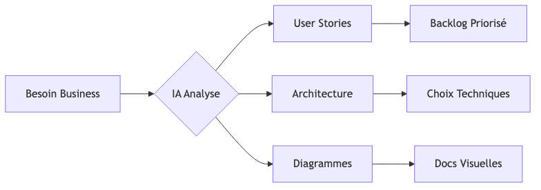

##### **Exemple concret : Planifier une API**

**Prompt à ChatGPT/Claude :**

```
Tu es un architecte logiciel senior. Je dois créer une API REST
pour gérer une bibliothèque de livres.

Fonctionnalités :
- CRUD sur les livres (titre, auteur, ISBN, année)
- Recherche par auteur/titre
- Système d'emprunt
- Authentification utilisateurs

1. Propose une architecture (microservices ou monolithe)
2. Définis les endpoints REST
3. Suggère les technologies (langage, base de données, auth)
4. Génère un diagramme d'architecture en Mermaid
```

**Réponse de l'IA :**

✅ Architecture proposée (monolithe pour MVP)
✅ Stack technique : FastAPI + PostgreSQL + JWT
✅ 12 endpoints REST documentés
✅ Diagramme d'architecture exploitable

**Temps économisé :** 2-3h de recherche et documentation

##### **Générer des diagrammes automatiquement**

**Prompt pour diagramme de classes :**

```
Génère un diagramme de classes Mermaid pour un système de bibliothèque
avec : User, Book, Loan, Author
```

**Résultat attendu :**


#### 2️⃣ Codage (🤖 35-55% de gain)

##### **Les 3 modes d'utilisation de l'IA**

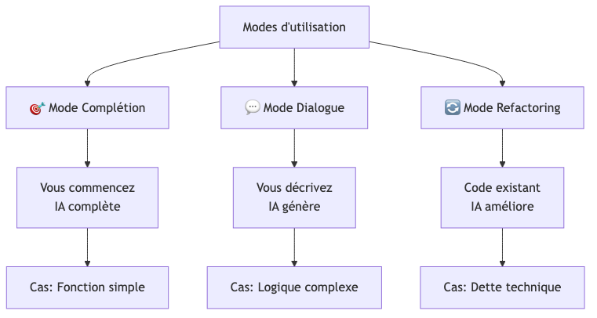

##### **Mode 1 : Complétion automatique**

**Scénario :** Écrire une fonction de validation

```python
# Vous tapez :
def validate_email(email: str) -> bool:
    """Valide le format d'un email"""

# Copilot suggère automatiquement :
    import re
    pattern = r'^[a-zA-Z0-9._%+-]+@[a-zA-Z0-9.-]+\.[a-zA-Z]{2,}$'
    return re.match(pattern, email) is not None
```

**Gain :** 2-3 minutes par fonction + évite recherche regex

##### **Mode 2 : Génération par dialogue**

**Scénario :** Implémenter un endpoint FastAPI complexe

**Votre prompt (en commentaire) :**

```python
# Crée un endpoint POST /api/books qui :
# - Reçoit un JSON avec title, author_id, isbn, year
# - Valide que l'ISBN n'existe pas déjà
# - Crée le livre en base
# - Retourne 201 avec le livre créé ou 400 si ISBN existe
```

**Copilot génère :**

```python
@router.post("/api/books", status_code=201)
async def create_book(
    book: BookCreate,
    db: Session = Depends(get_db)
):
    # Vérifier si ISBN existe
    existing = db.query(Book).filter(Book.isbn == book.isbn).first()
    if existing:
        raise HTTPException(400, "ISBN already exists")

    # Créer le livre
    new_book = Book(**book.dict())
    db.add(new_book)
    db.commit()
    db.refresh(new_book)

    return new_book
```

##### **Mode 3 : Refactoring assisté**

**Code initial (dette technique) :**

```python
def process_data(data):
    result = []
    for item in data:
        if item['status'] == 'active' and item['price'] > 0:
            discount = item['price'] * 0.1 if item['vip'] else 0
            final = item['price'] - discount
            result.append({'id': item['id'], 'final_price': final})
    return result
```

**Prompt pour Copilot Chat :**

```
Refactorise cette fonction pour :
1. Meilleure lisibilité
2. Type hints
3. Extraire la logique discount
4. Utiliser dataclasses
```

**Code refactorisé :**

```python
from dataclasses import dataclass
from typing import List, Dict

@dataclass
class Product:
    id: str
    price: float
    status: str
    vip: bool

def calculate_discount(price: float, is_vip: bool) -> float:
    """Calcule la remise selon le statut VIP"""
    return price * 0.1 if is_vip else 0.0

def process_active_products(products: List[Dict]) -> List[Dict]:
    """Traite les produits actifs et calcule les prix finaux"""
    return [
        {
            'id': p['id'],
            'final_price': p['price'] - calculate_discount(p['price'], p['vip'])
        }
        for p in products
        if p['status'] == 'active' and p['price'] > 0
    ]
```

#### 3️⃣ Tests (🤖 40-60% de gain)

##### **Génération automatique de tests**

**Fonction à tester :**

```python
def calculate_loan_duration(borrow_date: datetime, return_date: datetime) -> int:
    """Calcule la durée d'emprunt en jours"""
    if return_date < borrow_date:
        raise ValueError("Return date cannot be before borrow date")
    return (return_date - borrow_date).days
```

**Prompt :**

```python
# Génère des tests pytest pour calculate_loan_duration
# Teste : cas normal, même jour, erreur dates inversées, dates futures
```

**Tests générés :**

```python
import pytest
from datetime import datetime, timedelta

def test_calculate_loan_duration_normal():
    borrow = datetime(2024, 1, 1)
    return_date = datetime(2024, 1, 15)
    assert calculate_loan_duration(borrow, return_date) == 14

def test_calculate_loan_duration_same_day():
    date = datetime(2024, 1, 1)
    assert calculate_loan_duration(date, date) == 0

def test_calculate_loan_duration_invalid_dates():
    borrow = datetime(2024, 1, 15)
    return_date = datetime(2024, 1, 1)
    with pytest.raises(ValueError, match="Return date cannot be before"):
        calculate_loan_duration(borrow, return_date)

def test_calculate_loan_duration_future_dates():
    borrow = datetime(2025, 6, 1)
    return_date = datetime(2025, 6, 30)
    assert calculate_loan_duration(borrow, return_date) == 29
```

#### 4️⃣ Documentation (🤖 70-80% de gain)

##### **Génération de docstrings**

**Prompt :**

```python
# Génère une docstring Google style pour cette fonction
def search_books(query: str, filters: Dict, limit: int = 10) -> List[Book]:
    # implémentation...
```

**Résultat :**

```python
def search_books(query: str, filters: Dict, limit: int = 10) -> List[Book]:
    """
    Recherche des livres selon une requête et des filtres.

    Args:
        query (str): Terme de recherche (titre ou auteur).
        filters (Dict): Filtres additionnels (année, genre, etc.).
        limit (int, optional): Nombre max de résultats. Défaut: 10.

    Returns:
        List[Book]: Liste des livres correspondants, triés par pertinence.

    Raises:
        ValueError: Si le limit est négatif ou supérieur à 100.

    Example:
        >>> books = search_books("Tolkien", {"year": 1954}, limit=5)
        >>> len(books)
        5
    """
    # implémentation...
```

#### 📊 Tableau récapitulatif des gains

| Phase | Tâches automatisables | Gain temps | Outils IA |
|-------|----------------------|------------|-----------|
| **Planification** | Architecture, diagrammes, user stories | 20-30% | ChatGPT, Claude |
| **Codage** | Génération code, complétion, refactoring | 35-55% | Copilot, Cursor |
| **Tests** | Tests unitaires, cas limites | 40-60% | Copilot, TestGen |
| **Documentation** | Docstrings, README, API docs | 70-80% | Copilot Chat |
| **Review** | Détection bugs, suggestions | 15-25% | CodeRabbit, Copilot |

#### 📌 Points Clés

- ✅ L'IA intervient à **chaque étape** du cycle
- ✅ Gains les plus importants : **Documentation et Tests**
- ✅ Vous gardez le **contrôle et la validation finale**
- ⚠️ Toujours **relire et comprendre** le code généré

---

### **Chapitre 3 : Maîtriser le Prompt Engineering**

#### 🎯 Qu'est-ce que le Prompt Engineering ?


**Définition :** L'art de formuler des instructions claires et précises pour obtenir les meilleurs résultats d'une IA.

#### 🏗️ Anatomie d'un bon prompt


#### 📋 Framework de Prompt : RACE

| Élément | Description | Exemple |
|---------|-------------|---------|
| **R**ôle | Définir l'expertise de l'IA | "Tu es un développeur Python senior" |
| **A**ction | Décrire la tâche précise | "Crée une fonction de hash sécurisé" |
| **C**ontexte | Fournir les détails | "Pour stocker des mots de passe en base" |
| **E**xemple | Donner un modèle | "Utilise bcrypt comme dans..." |

#### ✅ Exemples Bon vs Mauvais

##### **Exemple 1 : Générer une fonction**

❌ **Mauvais prompt :**
```
Fais une fonction de tri
```

✅ **Bon prompt :**
```
Tu es un expert Python. Crée une fonction qui trie une liste
de dictionnaires par une clé spécifique.

Contraintes :
- Paramètres : liste de dicts, nom de clé, ordre (asc/desc)
- Gérer le cas où la clé n'existe pas
- Type hints complets
- Docstring Google style

Exemple d'utilisation :
users = [{'name': 'Alice', 'age': 30}, {'name': 'Bob', 'age': 25}]
sorted_users = sort_by_key(users, 'age', order='asc')
```

##### **Exemple 2 : Déboguer du code**

❌ **Mauvais prompt :**
```
Mon code ne marche pas, corrige-le
```

✅ **Bon prompt :**
```
Ce code Python produit une erreur "KeyError: 'email'" :

[CODE ICI]

Contexte :
- Fonction qui extrait les emails d'utilisateurs
- Certains utilisateurs n'ont pas d'email
- Base de données MongoDB

Demande :
1. Identifie le problème
2. Propose 2 solutions (avec/sans valeur par défaut)
3. Explique pourquoi l'erreur se produit
```

#### 🎨 Templates de prompts réutilisables

##### **Template 1 : Création de fonction**

```
Tu es un développeur [LANGAGE] expert en [DOMAINE].

Crée une fonction qui [OBJECTIF].

Spécifications :
- Nom : [NOM_FONCTION]
- Paramètres : [LISTE_PARAMS]
- Retourne : [TYPE_RETOUR]
- Gestion erreurs : [EXCEPTIONS]

Contraintes :
- Type hints complets
- Docstring [FORMAT]
- Performance optimale
- [AUTRES CONTRAINTES]

Exemple d'utilisation :
[CODE EXEMPLE]
```

##### **Template 2 : Refactoring**

```
Refactorise ce code [LANGAGE] pour améliorer :
1. [CRITÈRE 1]
2. [CRITÈRE 2]
3. [CRITÈRE 3]

Code actuel :
[CODE]

Contraintes :
- Conserver la même signature
- Compatibilité [VERSION]
- [AUTRES CONTRAINTES]

Explique les changements apportés.
```

##### **Template 3 : Génération de tests**

```
Génère des tests [FRAMEWORK] pour cette fonction :

[CODE FONCTION]

Tests requis :
1. Cas nominal
2. Cas limites : [LISTE]
3. Cas d'erreur : [LISTE]

Format :
- Un test par fonction
- Noms descriptifs
- Commentaires expliquant le scénario
```

#### 📚 Créer votre bibliothèque de prompts

##### **Structure recommandée**

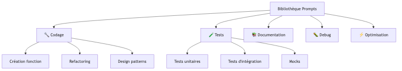

##### **Outil de gestion : Notion**

1. Créez une base de données Notion
2. Colonnes :
   - Nom du prompt
   - Catégorie (Codage, Tests, etc.)
   - Template
   - Variables à remplacer
   - Exemple d'utilisation
   - Tags (langage, framework)

3. Utilisez les favoris pour accès rapide

##### **Alternative : Fichier Markdown local**

Créez `prompts-library.md` dans votre projet :

```markdown
# Ma Bibliothèque de Prompts IA

## 🔧 Codage

### Création de fonction Python

**Variables :** {objectif}, {params}, {retour}

**Prompt :**
```
Tu es un développeur Python senior.
Crée une fonction qui {objectif}.
Paramètres : {params}
Retourne : {retour}
Avec type hints et docstring Google style.
```

**Exemple :**
[...]
```

#### 🎯 Techniques avancées

##### **1. Prompt multi-étapes**

Au lieu d'un prompt unique, décomposez :

```
Étape 1 :
"Analyse ce code et identifie les problèmes de sécurité"

[Attendre la réponse]

Étape 2 :
"Pour chaque problème identifié, propose une correction détaillée"

[Attendre la réponse]

Étape 3 :
"Génère le code corrigé complet avec commentaires"
```

##### **2. Few-shot learning (apprentissage par exemples)**

```
Voici 2 exemples de fonctions bien écrites :

Exemple 1 :
[CODE EXEMPLE 1]

Exemple 2 :
[CODE EXEMPLE 2]

Maintenant, crée une fonction similaire pour : [VOTRE BESOIN]
```

##### **3. Chain of Thought (Chaîne de pensée)**

```
Résous ce problème étape par étape :

1. Analyse le besoin
2. Identifie les edge cases
3. Propose une structure
4. Écris le code
5. Ajoute les tests

Problème : [DESCRIPTION]
```

#### 📌 Points Clés

- ✅ Un bon prompt = **Rôle + Action + Contexte + Exemple**
- ✅ Plus vous êtes **précis**, meilleur est le résultat
- ✅ Créez votre **bibliothèque de prompts** réutilisables
- ✅ Utilisez des **templates** pour gagner du temps
- ⚠️ Itérez : si le résultat n'est pas bon, **reformulez** le prompt

---

### **Chapitre 4 : Cas Pratiques Détaillés**

#### 🎯 Cas Pratique 1 : API REST complète avec FastAPI

##### **Contexte**

Créer une API de gestion de bibliothèque avec :
- CRUD sur les livres
- Système d'authentification
- Recherche avancée
- Tests complets

##### **Étape 1 : Architecture (5 minutes)**

**Prompt à ChatGPT :**

```
Tu es un architecte logiciel Python.

Projet : API REST de bibliothèque avec FastAPI

Fonctionnalités :
1. CRUD livres (titre, auteur, ISBN, année, disponible)
2. Authentification JWT
3. Recherche par titre/auteur
4. Emprunts de livres

Stack technique requise :
- FastAPI
- SQLAlchemy
- PostgreSQL
- JWT pour auth

Génère :
1. Structure de dossiers
2. Liste des endpoints avec méthodes HTTP
3. Schéma de base de données
4. Diagramme d'architecture Mermaid
```

**Résultat attendu :**

Structure de projet complète + endpoints définis + diagramme

##### **Étape 2 : Modèles de données (10 minutes)**

**Prompt à Copilot :**

```python
# Crée les modèles SQLAlchemy pour :
# - User (id, email, hashed_password, is_active, created_at)
# - Book (id, isbn, title, author, year, available, created_at)
# - Loan (id, user_id, book_id, borrow_date, return_date, returned_at)
#
# Avec relations :
# - User -> Loan (one to many)
# - Book -> Loan (one to many)
#
# Contraintes :
# - ISBN unique
# - Email unique
# - Foreign keys avec cascade
```

**Code généré vérifié et validé**

##### **Étape 3 : Schémas Pydantic (5 minutes)**

```python
# Crée les schémas Pydantic pour validation :
# - UserCreate (email, password)
# - UserResponse (id, email, created_at) - sans password
# - BookCreate (isbn, title, author, year)
# - BookResponse (id, isbn, title, author, year, available)
# - LoanCreate (book_id)
# - LoanResponse (id, book, borrow_date, return_date)
#
# Avec validators pour :
# - Email format valide
# - ISBN format (13 chiffres)
# - Année entre 1000 et année actuelle
```

##### **Étape 4 : Authentification JWT (15 minutes)**

**Prompt détaillé :**

```python
# Crée le système d'authentification JWT avec :
#
# 1. Fonction hash_password(password: str) -> str
#    - Utilise bcrypt
#
# 2. Fonction verify_password(plain: str, hashed: str) -> bool
#
# 3. Fonction create_access_token(data: dict) -> str
#    - JWT avec expiration 30 minutes
#    - Secret key depuis environment variable
#
# 4. Fonction get_current_user(token: str, db: Session) -> User
#    - Décode le token
#    - Vérifie expiration
#    - Retourne l'utilisateur ou raise HTTPException 401
#
# 5. Endpoint POST /auth/register
#    - Crée un utilisateur
#    - Hash le password
#    - Retourne UserResponse
#
# 6. Endpoint POST /auth/login
#    - Vérifie credentials
#    - Retourne access_token
```

##### **Étape 5 : Endpoints CRUD livres (15 minutes)**

```python
# Crée les endpoints pour les livres :
#
# 1. POST /books - Créer un livre (auth requise)
#    - Vérifie ISBN unique
#    - Retourne 201 + livre créé
#
# 2. GET /books - Lister les livres (public)
#    - Pagination (skip, limit)
#    - Filtres optionnels (available, year)
#    - Retourne liste + total count
#
# 3. GET /books/{book_id} - Détails d'un livre (public)
#    - Retourne 404 si non trouvé
#
# 4. PUT /books/{book_id} - Modifier un livre (auth requise)
#    - Mise à jour partielle autorisée
#
# 5. DELETE /books/{book_id} - Supprimer un livre (auth requise)
#    - Vérifie qu'aucun emprunt en cours
#    - Retourne 204
#
# 6. GET /books/search?q={query} - Recherche (public)
#    - Recherche dans titre ET auteur
#    - Case insensitive
```

##### **Étape 6 : Tests (20 minutes)**

```python
# Génère les tests pytest pour l'endpoint POST /books :
#
# Tests à créer :
# 1. test_create_book_success - Cas normal avec auth
# 2. test_create_book_unauthorized - Sans token
# 3. test_create_book_duplicate_isbn - ISBN existant
# 4. test_create_book_invalid_year - Année future
# 5. test_create_book_invalid_isbn - Format ISBN incorrect
#
# Utilise :
# - pytest
# - TestClient de FastAPI
# - Fixtures pour DB de test et user authentifié
```

##### **Étape 7 : Documentation (5 minutes)**

```python
# Ajoute la documentation OpenAPI pour l'endpoint POST /books :
#
# - Summary clair
# - Description détaillée
# - Exemples de requête/réponse
# - Documentation des status codes (201, 400, 401, 409)
# - Tags pour grouper dans Swagger
```

##### **📊 Résultat final**

- ✅ API complète fonctionnelle
- ✅ 15+ endpoints documentés
- ✅ Authentication sécurisée
- ✅ 20+ tests automatisés
- ✅ Documentation OpenAPI/Swagger

**Temps total :** ~1h30 (vs 6-8h sans IA)
**Gain :** 75-80%

---

#### 🎯 Cas Pratique 2 : Refactoring d'une Legacy Codebase

##### **Contexte**

Code legacy sans tests, pas de types, dette technique importante.

##### **Code initial (problématique)**

```python
def process(data):
    result = []
    for d in data:
        if d['type'] == 'A':
            x = d['value'] * 1.2
        elif d['type'] == 'B':
            x = d['value'] * 0.8
        else:
            x = d['value']

        if d['active']:
            y = x - (x * 0.1) if d['premium'] else x
            result.append({'id': d['id'], 'final': y, 'date': d['date']})

    return result
```

**Problèmes :**
- ❌ Pas de types
- ❌ Logique métier mélangée
- ❌ Noms de variables peu clairs
- ❌ Pas extensible
- ❌ Difficile à tester

##### **Étape 1 : Analyse (prompt)**

```
Analyse ce code Python et identifie :
1. Les problèmes de design
2. Les violations de SOLID
3. Les améliorations possibles
4. Les risques de bugs

[CODE]
```

##### **Étape 2 : Refactoring guidé**

```
Refactorise ce code en suivant :

1. Extraire la logique de calcul dans des fonctions séparées
2. Utiliser des dataclasses pour les données
3. Type hints complets
4. Pattern Strategy pour les types (A, B, default)
5. Rendre le code facilement testable

Conserve la même logique métier.
```

##### **Code refactorisé**

```python
from dataclasses import dataclass
from typing import List, Protocol
from datetime import datetime
from enum import Enum

class ProductType(Enum):
    TYPE_A = "A"
    TYPE_B = "B"
    DEFAULT = "default"

@dataclass
class ProductData:
    id: str
    type: ProductType
    value: float
    active: bool
    premium: bool
    date: datetime

@dataclass
class ProcessedProduct:
    id: str
    final: float
    date: datetime

class PricingStrategy(Protocol):
    def calculate(self, value: float) -> float:
        ...

class TypeAPricing:
    def calculate(self, value: float) -> float:
        return value * 1.2

class TypeBPricing:
    def calculate(self, value: float) -> float:
        return value * 0.8

class DefaultPricing:
    def calculate(self, value: float) -> float:
        return value

class DiscountCalculator:
    PREMIUM_DISCOUNT = 0.1

    @staticmethod
    def apply_discount(price: float, is_premium: bool) -> float:
        if is_premium:
            return price * (1 - DiscountCalculator.PREMIUM_DISCOUNT)
        return price

class ProductProcessor:
    def __init__(self):
        self.pricing_strategies = {
            ProductType.TYPE_A: TypeAPricing(),
            ProductType.TYPE_B: TypeBPricing(),
            ProductType.DEFAULT: DefaultPricing(),
        }

    def process_products(self, products: List[ProductData]) -> List[ProcessedProduct]:
        """
        Traite une liste de produits et calcule les prix finaux.

        Args:
            products: Liste des produits à traiter

        Returns:
            Liste des produits traités avec prix finaux
        """
        return [
            self._process_single_product(product)
            for product in products
            if product.active
        ]

    def _process_single_product(self, product: ProductData) -> ProcessedProduct:
        """Traite un produit unique."""
        # Appliquer la stratégie de pricing
        strategy = self.pricing_strategies.get(
            product.type,
            self.pricing_strategies[ProductType.DEFAULT]
        )
        base_price = strategy.calculate(product.value)

        # Appliquer la remise
        final_price = DiscountCalculator.apply_discount(
            base_price,
            product.premium
        )

        return ProcessedProduct(
            id=product.id,
            final=final_price,
            date=product.date
        )
```

##### **Étape 3 : Tests générés**

```python
# Génère des tests pytest complets pour ProductProcessor
# incluant tous les cas : Type A, B, default, premium, non-premium, actif/inactif
```

**Amélioration :**
- ✅ +300% de lignes mais 10x plus maintenable
- ✅ 100% testable
- ✅ SOLID compliant
- ✅ Facilement extensible (nouveaux types)

---

#### 📌 Points Clés de la Partie 1

- ✅ L'IA est un **outil**, pas une solution magique
- ✅ **Validez toujours** le code généré
- ✅ Utilisez des **prompts structurés** (RACE)
- ✅ L'IA excelle sur : **tests, documentation, boilerplate**
- ✅ Vous gardez la **responsabilité architecturale**

---

## **Partie 2 : 👔 Le Parcours du Manager - Piloter la Transformation IA**

> **🎯 Objectif de cette partie :** Définir et piloter l'adoption de l'IA dans votre équipe

---

### **Chapitre 1 : Comprendre l'Impact de l'IA**

#### 🌍 Vision stratégique


#### 📊 Les 4 dimensions de transformation


#### 1️⃣ Impact sur la Productivité

##### **Métriques clés**

| Métrique | Avant IA | Avec IA | Gain |
|----------|----------|---------|------|
| **Lignes de code/jour** | 100-150 | 180-250 | +60-80% |
| **Temps de code review** | 2h/jour | 1h/jour | -50% |
| **Temps documentation** | 1h/feature | 15min/feature | -75% |
| **Bugs post-déploiement** | 5/sprint | 2-3/sprint | -40-50% |
| **Couverture de tests** | 65% | 85% | +30% |

##### **Comment mesurer ?**

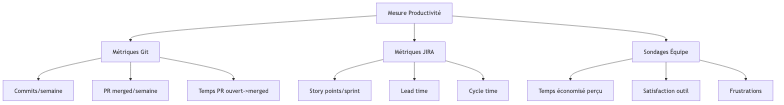

**Outils recommandés :**
- **LinearB** : Analytics automatiques sur Git/JIRA
- **Swarmia** : Engineering intelligence
- **Jellyfish** : Engineering metrics
- **Google Forms** : Sondages mensuels équipe

#### 2️⃣ Évolution des Compétences

##### **Le nouveau profil : Développeur Augmenté**


##### **Matrice de compétences**

| Compétence | Importance | Difficulté | Formation |
|------------|------------|------------|-----------|
| **Prompt Engineering** | ⭐⭐⭐⭐⭐ | ⭐⭐ | 1 semaine |
| **Revue de code IA** | ⭐⭐⭐⭐⭐ | ⭐⭐⭐ | 2 semaines |
| **Architecture avec IA** | ⭐⭐⭐⭐ | ⭐⭐⭐⭐ | 1 mois |
| **Sécurité & IA** | ⭐⭐⭐⭐⭐ | ⭐⭐⭐ | 1 semaine |
| **Éthique & IA** | ⭐⭐⭐ | ⭐⭐ | 2 jours |

#### 3️⃣ Transformation des Processus

##### **Processus de développement adapté**

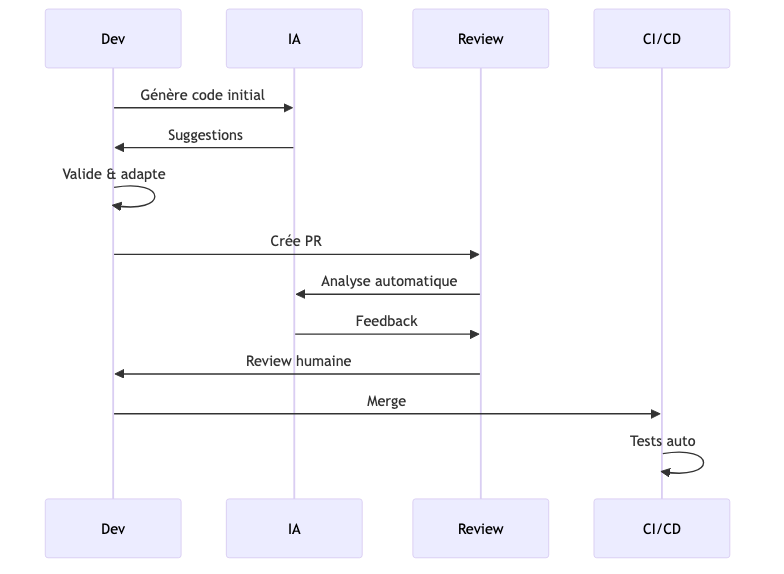

##### **Adaptations nécessaires**

| Processus | Avant | Avec IA | Changement |
|-----------|-------|---------|------------|
| **Definition of Done** | Tests + Review | Tests + Review + **Validation IA** | +1 étape |
| **Code Review** | Focus bugs | Focus **architecture & sécurité** | Niveau supérieur |
| **Estimation** | Story points temps | Story points **complexité** | Nouveau référentiel |
| **Sprint Planning** | Vélocité historique | **Vélocité ajustée IA** | +30-50% |

#### 4️⃣ Impact Culturel

##### **Mindset requis**


##### **Résistances courantes et solutions**

| Résistance | Cause | Solution |
|------------|-------|----------|
| **"L'IA va me remplacer"** | Peur du chômage | Montrer les stats : IA augmente, ne remplace pas |
| **"Je ne comprends pas le code généré"** | Manque de formation | Ateliers prompt engineering + pair programming |
| **"Ça va trop vite"** | Surcharge cognitive | Adoption progressive, pas tout en même temps |
| **"On perd notre savoir-faire"** | Peur de dé-skilling | Montrer la montée en compétence (architecture) |

#### 📈 ROI de l'IA

##### **Calcul simplifié**

```
Équipe de 10 développeurs
Coût mensuel Copilot : 10 × 10€ = 100€

Gain moyen : 30% de temps sur 50% des tâches = 15% gain global
15% de 10 devs = 1,5 dev équivalent temps plein

Valeur 1,5 dev/mois = ~7500-12000€ (selon salaires)

ROI = (Gain - Coût) / Coût = (7500 - 100) / 100 = 7400%
```

##### **Calcul détaillé (feuille de calcul)**

| Élément | Valeur |
|---------|--------|
| Nombre de développeurs | 10 |
| Salaire moyen mensuel | 5000€ |
| Coût IA/dev/mois | 10€ |
| **Coût total IA** | **100€** |
| Gain productivité moyen | 30% |
| % temps sur tâches automatisables | 50% |
| **Gain effectif** | **15%** |
| **Valeur gain** | **7500€** |
| **ROI** | **7400%** |

#### 📌 Points Clés

- ✅ L'IA transforme **4 dimensions** : productivité, compétences, processus, culture
- ✅ Gains mesurables : **+30-50% productivité**
- ✅ ROI exceptionnel : **>1000%** dans la plupart des cas
- ✅ Nécessite **accompagnement du changement**
- ⚠️ Résistances normales : **adressez-les proactivement**

---

### **Chapitre 2 : Définir sa Stratégie d'Adoption**

#### 🎯 Framework d'adoption en 4 phases


#### Phase 1 : Exploration (2-4 semaines)

##### **Objectifs**

- ✅ Évaluer les outils disponibles
- ✅ Identifier les use cases prioritaires
- ✅ Mesurer les gains potentiels
- ✅ Définir les critères de succès

##### **Actions**


##### **Livrable : Matrice d'évaluation des outils**

| Outil | Prix | Intégration IDE | Langages | Qualité Code | Sécurité | Note |
|-------|------|-----------------|----------|--------------|----------|------|
| **GitHub Copilot** | 10€/dev | ⭐⭐⭐⭐⭐ | ⭐⭐⭐⭐⭐ | ⭐⭐⭐⭐ | ⭐⭐⭐⭐⭐ | 9/10 |
| **Tabnine** | 12€/dev | ⭐⭐⭐⭐ | ⭐⭐⭐⭐ | ⭐⭐⭐ | ⭐⭐⭐⭐⭐ | 7.5/10 |
| **Cursor** | 20€/dev | ⭐⭐⭐⭐⭐ | ⭐⭐⭐⭐ | ⭐⭐⭐⭐⭐ | ⭐⭐⭐⭐ | 8.5/10 |
| **Codeium** | Gratuit | ⭐⭐⭐ | ⭐⭐⭐ | ⭐⭐⭐ | ⭐⭐⭐ | 6/10 |

#### Phase 2 : Pilote (1-2 mois)

##### **Objectifs**

- ✅ Tester à échelle réduite (1 équipe)
- ✅ Mesurer les gains réels
- ✅ Identifier les blocages
- ✅ Ajuster les processus

##### **Plan de pilote**


##### **Équipe pilote idéale**

**Critères de sélection :**

- ✅ **Volontaires** (pas forcés)
- ✅ **Mix de niveaux** (junior, senior)
- ✅ **Projet actif** (pas en maintenance)
- ✅ **Taille** : 4-6 personnes
- ✅ **Manager impliqué**

**Rôles dans le pilote :**

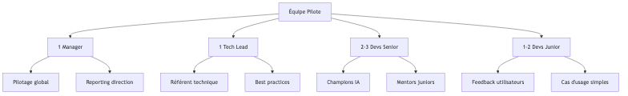

##### **Métriques à suivre**

**Dashboard hebdomadaire :**

| Métrique | Semaine 1 | Semaine 2 | Semaine 4 | Semaine 8 | Objectif |
|----------|-----------|-----------|-----------|-----------|----------|
| **% devs utilisant l'IA quotidiennement** | 60% | 75% | 90% | 95% | >90% |
| **Lignes suggérées acceptées** | 45% | 55% | 65% | 70% | >60% |
| **Temps économisé/dev/jour** | 20min | 35min | 1h | 1h15 | >1h |
| **Satisfaction (1-5)** | 3.5 | 4.0 | 4.3 | 4.5 | >4.0 |
| **Bugs liés à l'IA** | 2 | 1 | 0 | 0 | 0 |

#### Phase 3 : Déploiement (2-3 mois)

##### **Stratégie de rollout**


##### **Plan de communication**

| Moment | Canal | Message | Audience |
|--------|-------|---------|----------|
| **J-14** | All-hands | Annonce déploiement + bénéfices | Tous |
| **J-7** | Email | Guide démarrage rapide | Vague suivante |
| **J-1** | Slack | Reminder + support disponible | Vague suivante |
| **J+2** | Office hours | Session Q&A live | Nouveaux users |
| **Hebdo** | Newsletter | Tips & best practices | Tous |

#### Phase 4 : Optimisation Continue

##### **Boucle d'amélioration**


##### **Activités mensuelles**

- 📊 **Review métriques** : Productivité, qualité, satisfaction
- 💬 **Sondage équipe** : Frustrations, suggestions
- 🎓 **Formation continue** : Nouvelles fonctionnalités, techniques avancées
- 🏆 **Reconnaissance** : Partager les success stories
- 🔄 **Ajustements** : Processus, outils, guidelines

#### 🎯 KPIs de Succès

##### **Dashboard Manager**

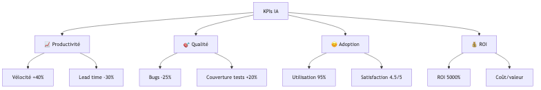

##### **Métriques détaillées**

| Catégorie | Métrique | Baseline | Objectif 3 mois | Objectif 6 mois |
|-----------|----------|----------|-----------------|-----------------|
| **Productivité** | Story points/sprint | 40 | 50 (+25%) | 55 (+37%) |
| | Lead time (jours) | 5 | 3.5 (-30%) | 3 (-40%) |
| | PR/semaine | 15 | 20 (+33%) | 22 (+47%) |
| **Qualité** | Bugs production/sprint | 8 | 6 (-25%) | 5 (-37%) |
| | Couverture tests % | 70% | 80% (+14%) | 85% (+21%) |
| | Temps moyen résolution bug (h) | 4 | 3 (-25%) | 2.5 (-37%) |
| **Adoption** | Utilisation quotidienne % | 0% | 85% | 95% |
| | Satisfaction outil (1-5) | - | 4.0 | 4.5 |
| | Suggestions acceptées % | - | 60% | 70% |
| **ROI** | Coût mensuel (€) | 0 | 100 | 100 |
| | Valeur créée (€) | - | 7500 | 10000 |
| | ROI % | - | 7400% | 9900% |

#### 🛡️ Gouvernance & Sécurité

##### **Règles d'utilisation**


##### **Checklist de sécurité**

- [ ] **Jamais** soumettre de clés API, tokens, mots de passe
- [ ] **Jamais** soumettre de données personnelles clients
- [ ] **Toujours** relire le code généré avant commit
- [ ] **Toujours** exécuter les tests sur code IA
- [ ] **Utiliser** version entreprise des outils (pas de training sur votre code)
- [ ] **Configurer** analyseurs statiques (SonarQube, Snyk)
- [ ] **Former** l'équipe sur les risques

#### 📌 Points Clés

- ✅ Adoption progressive : **Exploration → Pilote → Déploiement → Optimisation**
- ✅ Pilote avec **équipe volontaire** sur **projet actif**
- ✅ Mesurer **avant/après** avec KPIs clairs
- ✅ Communiquer **régulièrement** sur les bénéfices
- ✅ Sécurité : **guidelines strictes** sur données sensibles
- ⚠️ ROI exceptionnel mais **nécessite accompagnement**

---

### **Chapitre 3 : Mesurer et Garantir la Qualité**

#### 🎯 Le triptyque qualité


#### 1️⃣ Processus de Revue Adapté

##### **Avant vs Après IA**

| Aspect | Code Review Traditionnelle | Code Review avec IA |
|--------|----------------------------|---------------------|
| **Focus** | Syntaxe, bugs, logic | **Architecture, sécurité, design patterns** |
| **Temps moyen** | 30-45 min | **15-20 min** (IA détecte bugs basiques) |
| **Questions clés** | "Est-ce que ça marche ?" | **"Pourquoi ce design ? Alternatives ?"** |
| **Niveau** | Tactique | **Stratégique** |

##### **Checklist de review pour code IA**

```markdown
## Code Review - Code généré/assisté par IA

### 🔍 Compréhension
- [ ] J'ai lu et **compris** chaque ligne de code
- [ ] Je peux **expliquer** la logique à un collègue
- [ ] Les noms de variables/fonctions sont **explicites**

### 🏗️ Architecture
- [ ] Le code suit nos **conventions** (style guide)
- [ ] Le code respecte les **principes SOLID**
- [ ] Pas de **duplication** de code existant
- [ ] Bonne **séparation des responsabilités**

### 🔒 Sécurité
- [ ] Pas de **secrets** en dur (API keys, passwords)
- [ ] **Validation** des inputs utilisateur
- [ ] Pas de **vulnérabilités** connues (injection SQL, XSS, etc.)
- [ ] Dépendances à jour et **sans CVE**

### 🧪 Tests
- [ ] **Tests unitaires** présents et pertinents
- [ ] Couverture des **cas limites**
- [ ] Tests **passent** localement
- [ ] **Mocks** appropriés

### 📚 Documentation
- [ ] **Docstrings** présents et à jour
- [ ] Code **auto-documenté** (noms clairs)
- [ ] Commentaires seulement si **nécessaire**

### ⚡ Performance
- [ ] Pas d'**algorithme inefficace** évident
- [ ] Pas de **requêtes N+1** (si DB)
- [ ] Complexité **acceptable** (pas de O(n³) inutile)
```

#### 2️⃣ Outils d'Analyse Automatique

##### **Stack qualité recommandée**


##### **Configuration type**

**1. Linters (Qualité syntaxique)**

```yaml
# .github/workflows/quality.yml
name: Code Quality

on: [pull_request]

jobs:
  lint:
    runs-on: ubuntu-latest
    steps:
      - uses: actions/checkout@v3

      # Python
      - name: Lint with flake8
        run: |
          pip install flake8
          flake8 . --count --max-complexity=10 --max-line-length=100

      # JavaScript
      - name: Lint with ESLint
        run: |
          npm install
          npx eslint .
```

**2. SAST - Static Application Security Testing**

```yaml
# Snyk ou SonarQube
- name: Run Snyk Security Scan
  uses: snyk/actions/python@master
  env:
    SNYK_TOKEN: ${{ secrets.SNYK_TOKEN }}
```

**3. Dependency Scanning**

```yaml
- name: Dependency Review
  uses: actions/dependency-review-action@v3
  with:
    fail-on-severity: high
```

##### **Quality Gates**

| Outil | Métrique | Seuil Bloquant | Seuil Warning |
|-------|----------|----------------|---------------|
| **SonarQube** | Code coverage | < 70% | < 80% |
| | Code smells | > 10 | > 5 |
| | Bugs | > 0 | - |
| | Vulnerabilities | > 0 | - |
| **Snyk** | Vulnérabilités critiques | > 0 | - |
| | Vulnérabilités hautes | > 3 | > 1 |
| **ESLint/Flake8** | Erreurs | > 0 | - |
| | Warnings | - | > 20 |

#### 3️⃣ Culture de la Qualité

##### **Principes non-négociables**

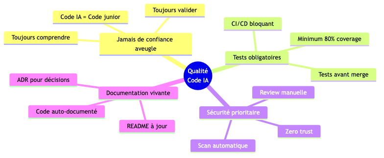

##### **Rituel qualité hebdomadaire**

**"Quality Hour" - 1h/semaine**


#### 📊 Dashboard Qualité

##### **Métriques à suivre**

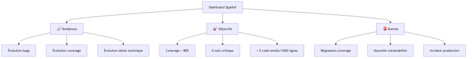

##### **Tableau de bord type**

| Indicateur | Valeur | Tendance | Objectif | Status |
|------------|--------|----------|----------|--------|
| **Test Coverage** | 82% | 📈 +3% | > 80% | ✅ |
| **Bugs Production** | 3 | 📉 -2 | < 5 | ✅ |
| **Dette Technique** | 12j | 📈 +2j | < 10j | ⚠️ |
| **Vulnérabilités Critiques** | 0 | → 0 | 0 | ✅ |
| **Vulnérabilités Hautes** | 2 | 📉 -1 | < 3 | ✅ |
| **Code Smells** | 45 | 📈 +8 | < 50 | ⚠️ |
| **Duplication %** | 3.2% | 📉 -0.5% | < 5% | ✅ |

#### 📌 Points Clés

- ✅ Code review **obligatoire** même avec IA
- ✅ **Automatiser** les vérifications (linters, SAST, tests)
- ✅ Quality gates **bloquantes** dans CI/CD
- ✅ Culture **"IA = junior developer"** : toujours valider
- ✅ Dashboard qualité **visible** de tous
- ⚠️ Ne jamais **sacrifier la qualité pour la vitesse**

---

### **Chapitre 4 : Gérer le Changement**

#### 🎯 La courbe du changement

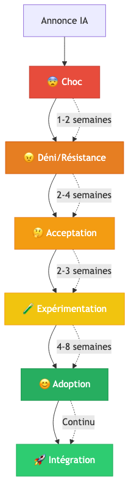

#### 1️⃣ Anticiper les Résistances

##### **Typologie des profils**


##### **Stratégies par profil**

| Profil | Caractéristiques | Stratégie | Actions |
|--------|------------------|-----------|---------|
| **Innovators** | Veulent tester immédiatement | Les nommer **champions** | Pilote, mentors, évangélisation |
| **Early Adopters** | Convaincus par la démo | Former en **priorité** | Formation approfondie, feedback loops |
| **Pragmatiques** | Veulent des **preuves** | Montrer **résultats pilote** | Métriques, témoignages, quick wins |
| **Sceptiques** | Peur du changement | **Accompagnement** personnalisé | 1-on-1, formation dédiée, rassurer |

#### 2️⃣ Plan de Communication

##### **Timeline de communication**

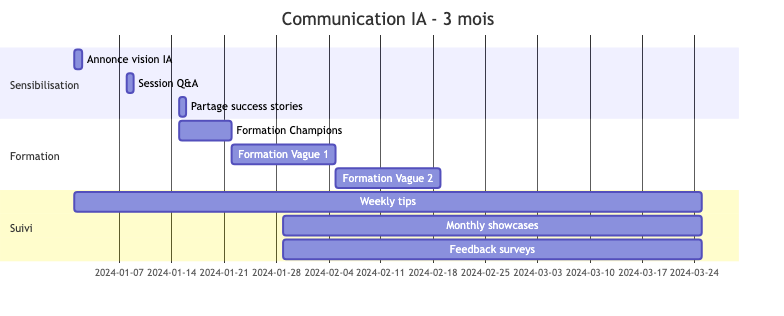

##### **Messages clés par étape**

**Semaine -2 : Annonce**

> 🎯 **Message** : "Nous adoptons l'IA pour **vous libérer** des tâches répétitives et **vous concentrer** sur ce qui compte : l'architecture, la créativité, la résolution de problèmes."
>
> 📊 **Support** : Slides avec ROI, témoignages autres entreprises
>
> ❓ **Q&A** : Adresser les peurs (remplacement, compétences)

**Semaine 0 : Lancement Pilote**

> 🚀 **Message** : "L'équipe [X] démarre le pilote. Suivez leurs retours et posez vos questions !"
>
> 📺 **Support** : Live demo, canal Slack dédié
>
> 🎁 **Incentive** : Reconnaissance publique équipe pilote

**Semaine 4 : Premiers Résultats**

> 📈 **Message** : "Le pilote montre +35% de productivité, 4.2/5 satisfaction. Voici 3 cas concrets..."
>
> 📊 **Support** : Dashboard métriques, témoignages vidéo
>
> 🎯 **CTA** : "Inscrivez-vous pour la vague 2"

**Semaine 8 : Déploiement Général**

> 🌍 **Message** : "Ouverture à tous ! Voici votre guide de démarrage rapide."
>
> 🛠️ **Support** : Guide PDF, vidéos tutorielles, office hours
>
> 🤝 **Support** : Buddy system (1 champion par équipe)

#### 3️⃣ Programme de Formation

##### **Parcours de formation**


##### **Niveau 1 : Débutant (4h)**

**Module 1 : Installation & Setup (1h)**
- Installation VS Code + Copilot
- Configuration initiale
- Test de base
- Raccourcis clavier

**Module 2 : Premiers Pas (2h)**
- Générer votre première fonction
- Complétion automatique
- Génération de tests
- Exercices pratiques

**Module 3 : Bonnes Pratiques (1h)**
- Ce qu'il faut faire / ne pas faire
- Sécurité de base
- Validation du code généré
- Quiz de certification

##### **Niveau 2 : Intermédiaire (5h)**

**Module 1 : Prompt Engineering (2h)**
- Framework RACE
- Templates réutilisables
- Prompts multi-étapes
- Exercices avancés

**Module 2 : Revue de Code IA (2h)**
- Checklist de review
- Détecter le code "trop magique"
- Cas pratiques de bugs IA
- Atelier de revue

**Module 3 : Sécurité (1h)**
- Risques spécifiques IA
- Checklist sécurité
- Outils de détection
- Certification sécurité

##### **Format d'apprentissage**


#### 4️⃣ Reconnaissance et Célébration

##### **Programme de reconnaissance**

**Recognition Board (Slack/Teams)**

```markdown
## 🏆 IA Champions de la Semaine

### 🥇 Best Prompt Award
**@alice** - Prompt qui a généré une suite de tests complète en une fois
> "Tu es un expert pytest. Génère 15 tests pour cette classe Calculator..."

### 🥈 Best Refactoring
**@bob** - Réduction de 200 lignes de code tout en améliorant la lisibilité
> Dette technique -3 jours sur le module Auth

### 🥉 Best Helper
**@charlie** - A aidé 5 collègues à débloquer des situations cette semaine
> Office hours quotidiennes, super patient !
```

##### **Gamification**


#### 5️⃣ Feedback Loops

##### **Mécanismes de feedback**


##### **Sondage mensuel type**

```markdown
## 📊 Sondage IA - Mois de [Mois]

**1. Fréquence d'utilisation**
- [ ] Quotidienne
- [ ] Plusieurs fois/semaine
- [ ] Hebdomadaire
- [ ] Rarement
- [ ] Jamais

**2. Satisfaction globale** (1-5 étoiles)
⭐ ⭐ ⭐ ⭐ ⭐

**3. Temps économisé estimé/jour**
- [ ] < 15 min
- [ ] 15-30 min
- [ ] 30-60 min
- [ ] 1-2h
- [ ] > 2h

**4. Principal bénéfice**
- [ ] Génération de code
- [ ] Tests automatiques
- [ ] Documentation
- [ ] Apprentissage
- [ ] Autre : ______

**5. Principal problème rencontré**
[Réponse libre]
```

#### 📌 Points Clés

- ✅ Anticiper la **courbe du changement** (choc → adoption)
- ✅ Adapter la stratégie selon les **profils** (innovators → sceptiques)
- ✅ Communication **régulière et transparente**
- ✅ Formation **progressive** (débutant → avancé)
- ✅ **Célébrer** les succès et reconnaître les champions
- ✅ Boucles de **feedback** pour amélioration continue
- ⚠️ Le changement prend du **temps** (3-6 mois pour adoption complète)

---

## **Conclusion** 🎉

### L'IA : Un Partenaire, Pas un Remplaçant

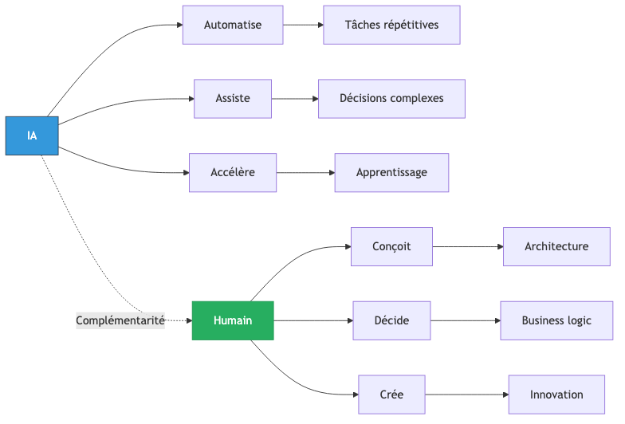

### Les 10 Commandements du Développement Augmenté par IA

1. **L'IA tu utiliseras**, mais jamais aveuglément tu ne lui feras confiance
2. **Le code généré tu comprendras**, avant de le commiter
3. **La sécurité tu privilégieras**, secrets et données sensibles jamais tu ne partageras
4. **Les tests tu écriras**, même si l'IA les suggère
5. **La revue de code tu pratiqueras**, avec rigueur et bienveillance
6. **Tes prompts tu structureras**, pour de meilleurs résultats obtenir
7. **En continu tu apprendras**, car l'IA évolue rapidement
8. **Tes découvertes tu partageras**, pour que l'équipe progresse ensemble
9. **La qualité tu mesureras**, avec des métriques objectives
10. **Patient tu resteras**, l'adoption est un marathon, pas un sprint

### Prochaines Étapes

#### Pour les Développeurs 👨‍💻

1. **Aujourd'hui** : Installez votre premier outil IA (30 min)
2. **Cette semaine** : Testez sur 3-5 tâches différentes
3. **Ce mois** : Créez votre bibliothèque de prompts
4. **Ce trimestre** : Devenez référent IA dans votre équipe

#### Pour les Managers 👔

1. **Cette semaine** : Calculez le ROI potentiel pour votre équipe
2. **Ce mois** : Lancez un pilote avec 1 équipe volontaire
3. **Ce trimestre** : Déployez à l'ensemble de l'organisation
4. **Cette année** : Intégrez l'IA dans tous vos processus

### Ressources pour Aller Plus Loin

**📚 Formation Continue**
- [GitHub Copilot Documentation](https://docs.github.com/copilot)
- [Prompt Engineering Guide](https://www.promptingguide.ai/)
- Chaîne YouTube : [Alex so yes](https://www.youtube.com/@alexsoyes)

**🛠️ Outils Recommandés**
- **Coding** : GitHub Copilot, Cursor, Tabnine
- **Chat** : ChatGPT, Claude, Perplexity
- **Code Review** : CodeRabbit, Codacy
- **Qualité** : SonarQube, Snyk

**👥 Communautés**
- Discord : AI Developers Community
- Reddit : r/AIProgramming
- Twitter : #AIcoding #DevWithAI

### Message Final

> **L'IA ne remplacera pas les développeurs.**
>
> **Mais les développeurs qui utilisent l'IA remplaceront ceux qui ne l'utilisent pas.**

L'opportunité est là. Saisissez-la. 🚀

---

## **Annexes**

### Foire Aux Questions (FAQ)

#### **1. L'IA va-t-elle me remplacer ?**

**Réponse courte :** Non.

**Réponse longue :** L'IA est un outil d'augmentation, pas de remplacement. Les études montrent que :
- ✅ Les développeurs passent **moins de temps** sur les tâches répétitives
- ✅ Ils se concentrent **plus** sur l'architecture et la résolution de problèmes complexes
- ✅ Le besoin de **développeurs qualifiés augmente** avec l'IA (paradoxe de l'automation)

**Analogie :** L'IA est à la programmation ce que les IDE ont été aux éditeurs de texte. Personne n'est retourné à `vi` après avoir découvert IntelliJ ou VS Code.

#### **2. Comment garantir la sécurité de mon code ?**

**Actions concrètes :**

1. ✅ **Utilisez les versions entreprise** : GitHub Copilot for Business, Tabnine Enterprise
   - Garantie que votre code n'est pas utilisé pour l'entraînement
   - Données stockées dans votre région

2. ✅ **Jamais de secrets** : Ne soumettez jamais :
   - Clés API, tokens, mots de passe
   - Données personnelles clients
   - Code propriétaire de tiers

3. ✅ **Analysez le code généré** :
   - SAST tools (Snyk, SonarQube)
   - Dependency scanning
   - Code review humaine

4. ✅ **Formez l'équipe** sur les risques

#### **3. Quel est le budget à prévoir ?**

**Coûts directs :**

| Élément | Coût/mois | Pour 10 devs |
|---------|-----------|--------------|
| **GitHub Copilot** | 10€/dev | 100€ |
| **Formation initiale** | - | 2000€ (one-time) |
| **Outils qualité** (Snyk, SonarQube) | 50€/dev | 500€ |
| **Temps d'adaptation** | ~10% productivité perdue le 1er mois | ~5000€ |
| **TOTAL première année** | - | **~15 000€** |

**ROI :**
- Gain productivité : +35% sur 50% des tâches = **17.5% gain global**
- Valeur pour 10 devs : **8750€/mois** (salaire moyen 5000€)
- **ROI : 600%/an**

#### **4. Le code généré par l'IA est-il libre de droits ?**

**Situation juridique (2024) :**

- ✅ **GitHub/Microsoft** : "Vous êtes propriétaire du code que vous écrivez, y compris les suggestions acceptées"
- ✅ **Tabnine** : Licence MIT sur le code suggéré
- ⚠️ **Risque** : L'IA peut reproduire du code vu pendant l'entraînement

**Best practices :**

1. Utilisez les outils avec **filtre de duplication** (GitHub Copilot en a un)
2. Vérifiez les **licences des dépendances** suggérées
3. Effectuez une **revue de code** pour détecter du code "trop spécifique"
4. Consultez votre **service juridique** pour validation finale

#### **5. Comment convaincre ma direction / mon équipe ?**

**Pour convaincre la DIRECTION :**

1. 📊 **Présentez le ROI** :
   - Calcul détaillé coûts vs gains
   - Exemples d'autres entreprises (GitHub a publié une étude : +55% productivité)

2. 🎯 **Proposez un pilote limité** :
   - 1 équipe, 2 mois
   - Métriques avant/après
   - Budget <5000€

3. 🏆 **Mettez en avant la compétitivité** :
   - "Nos concurrents utilisent déjà l'IA"
   - "Risque de perdre nos meilleurs talents"

**Pour convaincre l'ÉQUIPE :**

1. 🎮 **Laissez-les tester** :
   - Essai gratuit 30 jours
   - Démo live sur vrai code

2. 💬 **Adressez les peurs** :
   - "Ça ne vous remplace pas"
   - "Ça vous libère pour des tâches plus intéressantes"

3. 🏅 **Montrez les bénéfices individuels** :
   - Moins de frustration sur le boilerplate
   - Apprentissage accéléré
   - Plus de reconnaissance (focus sur impact business)

#### **6. Quelle est la courbe d'apprentissage ?**

**Timeline réaliste :**

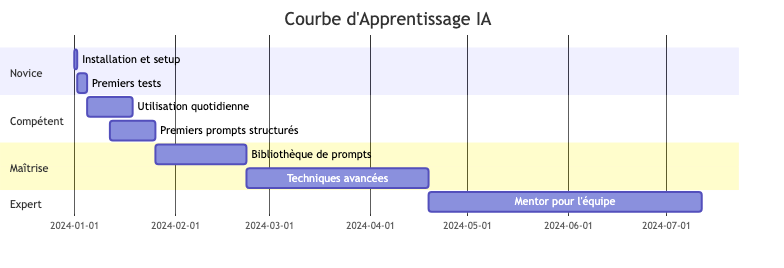

**Durée pour être productif :**
- ⚡ **Basique** : 1 jour (complétion simple)
- ✅ **Opérationnel** : 1-2 semaines (usage quotidien efficace)
- 🏆 **Maîtrise** : 2-3 mois (prompts avancés, architecture)

#### **7. Quel outil choisir ?**

**Matrice de décision :**

| Critère | GitHub Copilot | Cursor | Tabnine | Codeium |
|---------|----------------|--------|---------|---------|
| **Prix** | 💰 10€/mois | 💰💰 20€/mois | 💰 0-12€ | 💸 Gratuit |
| **Qualité suggestions** | ⭐⭐⭐⭐ | ⭐⭐⭐⭐⭐ | ⭐⭐⭐ | ⭐⭐⭐ |
| **IDE supportés** | ⭐⭐⭐⭐⭐ | ⭐⭐⭐ (fork VS Code) | ⭐⭐⭐⭐⭐ | ⭐⭐⭐⭐ |
| **Langages** | ⭐⭐⭐⭐⭐ | ⭐⭐⭐⭐ | ⭐⭐⭐⭐ | ⭐⭐⭐⭐ |
| **Sécurité entreprise** | ⭐⭐⭐⭐⭐ | ⭐⭐⭐⭐ | ⭐⭐⭐⭐⭐ | ⭐⭐⭐ |
| **Contexte projet** | ⭐⭐⭐ | ⭐⭐⭐⭐⭐ | ⭐⭐⭐ | ⭐⭐ |

**Recommandation :**
- 🥇 **Débutants** : GitHub Copilot (équilibre qualité/prix)
- 🥈 **Experts** : Cursor (meilleur contexte, chat intégré)
- 🥉 **Budget limité** : Codeium gratuit pour tester

#### **8. L'IA fonctionne-t-elle hors ligne ?**

**Réponse courte :** Non, la plupart des outils nécessitent internet.

**Détails :**
- ❌ GitHub Copilot, ChatGPT, Claude : **Cloud obligatoire**
- ✅ Tabnine : Version **on-premise** possible (entreprise)
- ✅ CodeLlama, StarCoder : **Modèles open-source** à héberger localement

**Implication :** Prévoir connexion internet stable pour l'équipe.

---

### Glossaire 📖

**IA (Intelligence Artificielle)** : Simulation de l'intelligence humaine par des machines, permettant d'apprendre, raisonner et s'améliorer.

**LLM (Large Language Model)** : Modèle d'IA entraîné sur d'immenses corpus de texte (ex: GPT-4, Claude, Llama). Capable de comprendre et générer du langage naturel et du code.

**Prompt Engineering** : Discipline consistant à formuler des instructions optimales pour obtenir les meilleurs résultats d'une IA. Framework recommandé : RACE (Rôle, Action, Contexte, Exemple).

**Hallucination de l'IA** : Phénomène où l'IA génère des informations fausses mais plausibles. **Risque majeur** : toujours vérifier les faits et le code.

**Code Boilerplate** : Code répétitif et nécessaire mais peu créatif (getters/setters, constructeurs, configuration). **Zone où l'IA excelle**.

**Complétion de code** : Suggestion automatique de code pendant la frappe, comme l'autocomplétion de texte sur smartphone.

**SAST (Static Application Security Testing)** : Analyse automatique du code source pour détecter des vulnérabilités de sécurité sans l'exécuter.

**CI/CD (Continuous Integration/Continuous Deployment)** : Pratique d'automatiser l'intégration et le déploiement de code. L'IA peut y être intégrée pour tests et analyses.

**Tech Debt / Dette Technique** : Code difficile à maintenir ou à faire évoluer, souvent dû à des compromis rapides. L'IA peut aider au refactoring.

**Definition of Done (DoD)** : Critères à remplir pour considérer une tâche terminée. Avec l'IA, ajoutez "Validation du code IA".

**ROI (Return on Investment)** : Retour sur investissement. Formule : (Gain - Coût) / Coût × 100%.

**Quality Gate** : Seuils qualité à respecter avant de merger du code (couverture tests, bugs, vulnérabilités).

**Base de données vectorielle** : Base de données optimisée pour la recherche de similarité sémantique. Utilisée avec les LLMs pour le RAG (Retrieval-Augmented Generation).

---

### Sources & Inspiration 🔗

#### **Inspiration Principale**

**[Alex so yes](https://www.youtube.com/@alexsoyes)** - Chaîne YouTube de référence pour le développement pragmatique avec IA. Approche directe, sans bullshit, orientée résultats.

#### **Études & Recherches**

- **GitHub (2023)** : "Research: quantifying GitHub Copilot's impact" - Étude montrant +55% de productivité
- **Stanford/MIT (2023)** : "The Impact of AI on Developer Productivity: Evidence from GitHub Copilot"
- **McKinsey (2023)** : "The state of AI in 2023: Generative AI's breakout year"

#### **Documentation Outils**

- [GitHub Copilot Docs](https://docs.github.com/copilot)
- [OpenAI Best Practices](https://platform.openai.com/docs/guides/prompt-engineering)
- [Anthropic Claude Docs](https://docs.anthropic.com/)

#### **Communautés**

- [r/AIProgramming](https://reddit.com/r/AIProgramming) - Reddit
- [AI Developers Discord](https://discord.gg/ai-dev)
- [Dev.to #ai](https://dev.to/t/ai) - Articles et discussions

#### **Livres Recommandés**

- "AI-Assisted Programming" - Tom Taulli (2024)
- "Prompt Engineering for Developers" - Jules White (2023)
- "The AI-First Company" - Ash Fontana (2024)

---

**Version du guide :** 2.0
**Dernière mise à jour :** Janvier 2025
**Auteur :** Inspiré par Alex so yes
**Licence :** CC BY-SA 4.0

---

*Ce guide est un document vivant. Vos retours et contributions sont les bienvenus !*
