# 📊 Diagrammes — Architecture et Workflows

## 🎯 Objectif

Cette section contient **tous les diagrammes** du projet AI Driven Dev : architectures, workflows, séquences, et visualisations des processus.

Tous les diagrammes sont créés avec **Mermaid**, ce qui permet :
- ✅ Visualisation directe dans GitHub/GitLab
- ✅ Édition facile (texte, pas d'image)
- ✅ Versionning Git
- ✅ Export en SVG/PNG possible

---

## 📋 Table des matières

1. [Architecture Globale](#1-architecture-globale)
2. [Workflows d'Adoption](#2-workflows-dadoption)
3. [Workflow de Développement](#3-workflow-de-développement)
4. [Pipeline CI/CD avec IA](#4-pipeline-cicd-avec-ia)
5. [Diagrammes des Exemples](#5-diagrammes-des-exemples)
6. [Diagrammes de Séquence](#6-diagrammes-de-séquence)
7. [Matrices de Décision](#7-matrices-de-décision)

---

## 1. Architecture Globale

### 1.1 Vue d'ensemble du projet

```mermaid
graph TB
    subgraph "AI Driven Dev Project"
        A[👤 Utilisateurs] --> B{Type}
        B -->|Développeur| C[📘 Quick Start Dev]
        B -->|Manager| D[📘 Quick Start Manager]

        C --> E[🧠 Prompts Library]
        C --> F[💡 Examples]
        C --> G[🔧 Tools Setup]

        D --> H[📊 Metrics Templates]
        D --> I[📚 AI Driven Dev Guide]

        E --> J[Code Generation]
        E --> K[Tests Automation]
        E --> L[Documentation]
        E --> M[Security Review]
        E --> N[CI/CD Integration]

        F --> O[5 Practical Examples]
        O --> P[Production-Ready Code]

        H --> Q[KPIs Dashboard]
        H --> R[ROI Calculator]

        I --> S[4 Adoption Phases]
        S --> T[Exploration]
        S --> U[Pilote]
        S --> V[Déploiement]
        S --> W[Optimisation]
    end

    style A fill:#e1f5ff
    style P fill:#d4edda
    style R fill:#fff3cd
```

### 1.2 Stack Technique


---

## 2. Workflows d'Adoption

### 2.1 Les 4 Phases d'Adoption

```mermaid
graph TD
    Start([Début]) --> Phase1[Phase 1: Exploration<br/>2-4 semaines]

    Phase1 --> A1[Sensibiliser l'équipe]
    Phase1 --> A2[Identifier volontaires]
    Phase1 --> A3[Choisir les outils]
    Phase1 --> A4[Définir périmètre pilote]

    A1 & A2 & A3 & A4 --> Decision1{Go Pilote?}

    Decision1 -->|Non| Stop1([Arrêt])
    Decision1 -->|Oui| Phase2[Phase 2: Pilote<br/>3-4 semaines]

    Phase2 --> B1[Acheter licences 2-3 devs]
    Phase2 --> B2[Formation initiale 2h]
    Phase2 --> B3[Projet pilote]
    Phase2 --> B4[Mesurer KPIs]

    B1 & B2 & B3 & B4 --> Decision2{ROI > 200%?}

    Decision2 -->|Non| Stop2([Prolonger<br/>ou Arrêt])
    Decision2 -->|Oui| Phase3[Phase 3: Déploiement<br/>1-3 mois]

    Phase3 --> C1[Licences toute équipe]
    Phase3 --> C2[Former 100% équipe]
    Phase3 --> C3[Créer charte IA]
    Phase3 --> C4[Support interne]

    C1 & C2 & C3 & C4 --> Decision3{Adoption > 80%?}

    Decision3 -->|Non| Adjust[Ajustements]
    Adjust --> Phase3
    Decision3 -->|Oui| Phase4[Phase 4: Optimisation<br/>Continu]

    Phase4 --> D1[Partage best practices]
    Phase4 --> D2[Intégration CI/CD]
    Phase4 --> D3[Automatisation]
    Phase4 --> D4[Amélioration continue]

    D1 & D2 & D3 & D4 --> Success([Équipe Augmentée<br/>ROI > 500%])

    style Phase1 fill:#e1f5ff
    style Phase2 fill:#fff3cd
    style Phase3 fill:#d4edda
    style Phase4 fill:#f8d7da
    style Success fill:#28a745,color:#fff
    style Stop1 fill:#dc3545,color:#fff
    style Stop2 fill:#dc3545,color:#fff
```

### 2.2 Timeline d'Adoption

```mermaid
gantt
    title Timeline d'Adoption de l'IA (4 mois)
    dateFormat YYYY-MM-DD
    section Phase 1: Exploration
    Sensibilisation équipe           :done, e1, 2024-01-01, 1w
    Identification volontaires        :done, e2, 2024-01-08, 1w
    Choix des outils                  :done, e3, 2024-01-15, 1w
    Définition périmètre              :done, e4, 2024-01-22, 1w

    section Phase 2: Pilote
    Achat licences pilote             :active, p1, 2024-01-29, 3d
    Formation initiale                :active, p2, 2024-02-01, 1d
    Projet pilote                     :p3, 2024-02-02, 3w
    Mesure et ajustements             :p4, 2024-02-23, 1w

    section Phase 3: Déploiement
    Achat licences équipe             :p5, 2024-03-01, 1w
    Formation complète                :p6, 2024-03-08, 2w
    Déploiement progressif            :p7, 2024-03-22, 4w

    section Phase 4: Optimisation
    Partage best practices            :p8, 2024-04-19, 4w
    Intégration CI/CD                 :p9, 2024-04-19, 4w
    Amélioration continue             :p10, 2024-05-17, 8w
```

---

## 3. Workflow de Développement

### 3.1 Workflow Quotidien avec IA

```mermaid
sequenceDiagram
    participant Dev as 👨‍💻 Développeur
    participant IDE as 💻 IDE + Copilot
    participant IA as 🤖 ChatGPT/Claude
    participant Git as 🔀 Git/GitHub
    participant CI as ⚙️ CI/CD

    Dev->>IA: 1. Analyser ticket/feature
    IA-->>Dev: Proposer 3 approches

    Dev->>IA: 2. Choisir approche + demander code
    IA-->>Dev: Générer code de base

    Dev->>IDE: 3. Copier code + adapter
    IDE->>Dev: Complétion temps réel (Copilot)

    Dev->>IA: 4. Générer tests unitaires
    IA-->>Dev: Suite de tests complète

    Dev->>IDE: 5. Exécuter tests
    IDE-->>Dev: Tests passent ✅

    Dev->>IA: 6. Demander revue de code
    IA-->>Dev: Suggestions d'amélioration

    Dev->>IDE: 7. Appliquer corrections
    Dev->>Git: 8. Commit + Push

    Git->>CI: 9. Trigger pipeline
    CI->>IA: 10. AI Code Review
    IA-->>CI: Rapport de revue
    CI->>Git: 11. Commenter PR

    Git-->>Dev: 12. Feedback + merge
```

### 3.2 Cycle de Vie d'une Feature avec IA

```mermaid
graph TB
    Start([Issue/Ticket]) --> A1[📝 Analyse avec IA]

    A1 --> A2{Complexité?}
    A2 -->|Simple| B1[IA génère code complet]
    A2 -->|Complexe| B2[IA propose architecture]

    B1 --> C1[Relecture développeur]
    B2 --> C2[Développeur implémente<br/>avec aide IA]
    C2 --> C1

    C1 --> D1[IA génère tests]
    D1 --> D2[Exécution tests]
    D2 --> D3{Tests OK?}

    D3 -->|Non| D4[IA debug erreurs]
    D4 --> D2
    D3 -->|Oui| E1[IA génère docs]

    E1 --> E2[IA revoit code]
    E2 --> E3{Qualité OK?}

    E3 -->|Non| E4[Corrections]
    E4 --> E2
    E3 -->|Oui| F1[Commit + PR]

    F1 --> F2[AI Code Review CI/CD]
    F2 --> F3{Review OK?}

    F3 -->|Non| F4[Ajustements]
    F4 --> F1
    F3 -->|Oui| G1[Merge]

    G1 --> G2[Deploy auto]
    G2 --> End([Feature en prod])

    style Start fill:#e1f5ff
    style End fill:#28a745,color:#fff
    style D3 fill:#fff3cd
    style E3 fill:#fff3cd
    style F3 fill:#fff3cd
```

---

## 4. Pipeline CI/CD avec IA

### 4.1 Workflow GitHub Actions avec IA

```mermaid
graph TB
    subgraph "Déclencheur"
        A1[Push/PR] --> A2{Branche?}
        A2 -->|PR| B[Pipeline PR]
        A2 -->|Main| C[Pipeline Deploy]
    end

    subgraph "Pipeline PR"
        B --> B1[Lint & Format]
        B --> B2[Tests Backend]
        B --> B3[Tests Frontend]
        B --> B4[Build]

        B1 & B2 & B3 & B4 --> B5[Tests E2E]
        B5 --> B6[🤖 AI Code Review]

        B6 --> B7{Qualité OK?}
        B7 -->|Non| B8[❌ Bloquer PR]
        B7 -->|Oui| B9[✅ Approuver PR]
    end

    subgraph "Pipeline Deploy"
        C --> C1[Tests de sécurité]
        C1 --> C2{Tests OK?}

        C2 -->|Non| C3[❌ Arrêter]
        C2 -->|Oui| C4[🤖 Générer docs IA]

        C4 --> C5[Commit docs]
        C5 --> C6[Deploy Frontend Vercel]
        C5 --> C7[Deploy Backend Railway]

        C6 & C7 --> C8[Tests smoke]
        C8 --> C9{Deploy OK?}

        C9 -->|Non| C10[🔄 Rollback]
        C9 -->|Oui| C11[📢 Notif Slack]
        C11 --> C12[✅ Success]
    end

    style B9 fill:#28a745,color:#fff
    style B8 fill:#dc3545,color:#fff
    style C3 fill:#dc3545,color:#fff
    style C10 fill:#ffc107
    style C12 fill:#28a745,color:#fff
```

### 4.2 Intégration IA dans CI/CD

```mermaid
graph LR
    subgraph "Événements"
        E1[PR Opened]
        E2[Push Main]
        E3[Nightly Build]
    end

    subgraph "Jobs IA"
        J1[🤖 AI Code Review<br/>GPT-4]
        J2[🤖 Auto-generate Docs<br/>Claude]
        J3[🤖 Security Audit<br/>GPT-4]
        J4[🤖 Performance Analysis<br/>Claude]
    end

    subgraph "Outputs"
        O1[📝 PR Comment]
        O2[📚 docs/ folder]
        O3[🔒 Security Report]
        O4[📊 Perf Report]
    end

    E1 --> J1
    J1 --> O1

    E2 --> J2
    J2 --> O2

    E3 --> J3
    E3 --> J4
    J3 --> O3
    J4 --> O4

    style J1 fill:#0366d6
    style J2 fill:#7c3aed
    style J3 fill:#dc3545
    style J4 fill:#28a745
```

---

## 5. Diagrammes des Exemples

### 5.1 Exemple 1 : Génération de Code


### 5.2 Exemple 2 : Tests Automation

```mermaid
graph LR
    A[Code Legacy<br/>0% couverture] --> B[📝 Prompt:<br/>Générer tests]
    B --> C[🤖 IA analyse code]

    C --> D[Tests nominaux]
    C --> E[Tests erreurs]
    C --> F[Tests limites]

    D & E & F --> G[26 tests générés]
    G --> H[Exécution]
    H --> I[96% couverture]

    I --> J[✅ Production-ready<br/>Gain: 83%]

    style A fill:#dc3545,color:#fff
    style I fill:#28a745,color:#fff
    style J fill:#28a745,color:#fff
```

### 5.3 Exemple 3 : Documentation

```mermaid
graph TB
    A[Code sans docs] --> B{Type doc?}

    B -->|README| C[🤖 Prompt README]
    B -->|API| D[🤖 Prompt OpenAPI]
    B -->|Code| E[🤖 Prompt JSDoc]

    C --> F[README.md complet<br/>Badges, Quick Start, Examples]
    D --> G[openapi.yaml<br/>Swagger compatible]
    E --> H[JSDoc dans code<br/>IntelliSense]

    F & G & H --> I[Documentation complète<br/>Gain: 92%]

    I --> J[✅ Production-ready<br/>5h → 25 min]

    style A fill:#ffc107
    style J fill:#28a745,color:#fff
```

### 5.4 Exemple 4 : CI/CD

```mermaid
graph TB
    A[Pas de CI/CD] --> B[🤖 Prompt: Pipeline complet]

    B --> C[Workflow PR]
    B --> D[Workflow Deploy]
    B --> E[Script AI Review]
    B --> F[Script Auto Docs]

    C --> G[Lint + Tests + Build]
    D --> H[Deploy Vercel + Railway]
    E --> I[Revue auto sur PR]
    F --> J[Docs auto-générées]

    G & H & I & J --> K[Pipeline complet<br/>Gain: 87%]

    K --> L[✅ Production-ready<br/>7h → 45 min]

    style A fill:#dc3545,color:#fff
    style L fill:#28a745,color:#fff
```

### 5.5 Exemple 5 : Security Review

```mermaid
graph TB
    A[Code vulnérable<br/>Score: 2.5/10] --> B[🤖 Audit OWASP Top 10]

    B --> C[15 vulnérabilités détectées]

    C --> D[🔴 4 Critical]
    C --> E[🟠 6 High]
    C --> F[🟡 3 Medium]
    C --> G[🔵 2 Low]

    D --> H[SQL Injection]
    D --> I[Hardcoded Secrets]
    D --> J[Data Exposure]
    D --> K[XSS]

    H & I & J & K --> L[🤖 Code corrigé]
    E & F & G --> L

    L --> M[Code sécurisé<br/>Score: 9.5/10]
    M --> N[✅ Production-ready<br/>Économie: 4 998€]

    style A fill:#dc3545,color:#fff
    style M fill:#28a745,color:#fff
    style N fill:#28a745,color:#fff
```

---

## 6. Diagrammes de Séquence

### 6.1 Interaction Développeur - IA - GitHub

```mermaid
sequenceDiagram
    autonumber
    actor Dev as 👨‍💻 Dev
    participant IDE as 💻 VS Code
    participant Copilot as 🤖 Copilot
    participant ChatGPT as 💬 ChatGPT
    participant Git as 🔀 GitHub
    participant Actions as ⚙️ Actions
    participant AI_Review as 🤖 AI Review

    Dev->>ChatGPT: Analyser feature
    ChatGPT-->>Dev: Proposition architecture

    Dev->>ChatGPT: Générer code de base
    ChatGPT-->>Dev: Code + tests

    Dev->>IDE: Copier code
    loop Développement
        IDE->>Copilot: Complétion temps réel
        Copilot-->>IDE: Suggestions
    end

    Dev->>ChatGPT: Générer tests supp.
    ChatGPT-->>Dev: Tests complets

    Dev->>IDE: Exécuter tests
    IDE-->>Dev: ✅ Tests OK

    Dev->>ChatGPT: Revue de code
    ChatGPT-->>Dev: Suggestions

    Dev->>Git: git commit + push
    Git->>Actions: Trigger CI/CD

    Actions->>AI_Review: Analyser diff
    AI_Review-->>Actions: Rapport revue

    Actions->>Git: Comment PR
    Git-->>Dev: Notification

    Dev->>Git: Merge PR
    Git->>Actions: Deploy
    Actions-->>Dev: ✅ Déployé
```

### 6.2 Process de Revue de Code avec IA

```mermaid
sequenceDiagram
    participant Dev as 👨‍💻 Développeur
    participant PR as 📝 Pull Request
    participant AI as 🤖 GPT-4
    participant Human as 👥 Reviewer Humain
    participant Main as 🌳 main branch

    Dev->>PR: Créer PR
    PR->>AI: Trigger AI Review

    AI->>AI: Analyser diff
    AI->>AI: Détecter issues
    AI->>AI: Générer suggestions

    AI-->>PR: Commenter PR<br/>- Bugs potentiels<br/>- Perf issues<br/>- Security

    Dev->>Dev: Lire feedback IA
    Dev->>PR: Corriger issues

    PR->>Human: Request human review
    Human->>Human: Vérifier logique métier
    Human->>Human: Valider architecture

    alt Changements requis
        Human-->>Dev: Demander changements
        Dev->>PR: Push corrections
        PR->>AI: Re-review
    else Approuvé
        Human-->>PR: ✅ Approve
        PR->>Main: Merge
    end
```

---

## 7. Matrices de Décision

### 7.1 Choix de l'Outil IA

```mermaid
graph TD
    Start{Quel besoin?} --> Need1[Complétion temps réel]
    Start --> Need2[Questions complexes]
    Start --> Need3[Analyse de code]
    Start --> Need4[IDE complet]

    Need1 --> Tool1[GitHub Copilot<br/>10$/mois]
    Need2 --> Tool2[ChatGPT Plus<br/>20$/mois]
    Need3 --> Tool3[Claude Pro<br/>20$/mois]
    Need4 --> Tool4[Cursor<br/>20$/mois]

    Tool1 --> Best1[✅ Meilleur pour<br/>autocomplétion]
    Tool2 --> Best2[✅ Meilleur pour<br/>architecture]
    Tool3 --> Best3[✅ Meilleur pour<br/>refactoring]
    Tool4 --> Best4[✅ Meilleur pour<br/>génération multi-fichiers]

    style Tool1 fill:#0366d6
    style Tool2 fill:#10a37f
    style Tool3 fill:#d97706
    style Tool4 fill:#7c3aed
```

### 7.2 ROI par Cas d'Usage

```mermaid
graph LR
    subgraph "Cas d'Usage"
        U1[Génération Code]
        U2[Tests Auto]
        U3[Documentation]
        U4[CI/CD]
        U5[Security]
    end

    subgraph "Temps Gagné"
        T1[83%]
        T2[83%]
        T3[92%]
        T4[87%]
        T5[94%]
    end

    subgraph "ROI"
        R1[650%]
        R2[900%]
        R3[1200%]
        R4[1000%]
        R5[1500%]
    end

    U1 --> T1 --> R1
    U2 --> T2 --> R2
    U3 --> T3 --> R3
    U4 --> T4 --> R4
    U5 --> T5 --> R5

    style R1 fill:#28a745,color:#fff
    style R2 fill:#28a745,color:#fff
    style R3 fill:#28a745,color:#fff
    style R4 fill:#28a745,color:#fff
    style R5 fill:#28a745,color:#fff
```

---

## 📊 Comment utiliser ces diagrammes

### Visualiser dans GitHub

Les diagrammes Mermaid sont **automatiquement rendus** dans GitHub :
1. Ouvrir ce fichier sur GitHub
2. Les diagrammes s'affichent directement
3. Pas besoin d'outil externe

### Exporter en SVG/PNG

**Méthode 1 : Mermaid Live Editor**
1. Aller sur [mermaid.live](https://mermaid.live)
2. Copier le code Mermaid
3. Télécharger en SVG ou PNG

**Méthode 2 : CLI**
```bash
# Installer mermaid-cli
npm install -g @mermaid-js/mermaid-cli

# Exporter
mmdc -i diagram.mmd -o diagram.svg
```

### Intégrer dans une présentation

1. Exporter en SVG (haute qualité)
2. Importer dans PowerPoint/Keynote
3. Redimensionner sans perte de qualité

---

## 🔗 Ressources

- [Mermaid Documentation](https://mermaid.js.org/)
- [Mermaid Live Editor](https://mermaid.live)
- [Guide complet AI Driven Dev](../../guides/AI_Driven_Dev_Guide.md)

---

**14 diagrammes créés**
**Couvre 100% des workflows du projet**
**Prêt pour présentation et documentation**
