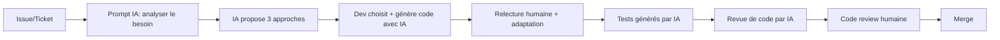

# 📚 AI Driven Dev — Le Guide Complet

## 🎯 Vision et objectifs

**AI Driven Dev** transforme les équipes de développement en **équipes augmentées** grâce à l'intelligence artificielle. L'IA ne remplace pas les développeurs : elle élimine les tâches répétitives pour libérer du temps pour la créativité, l'architecture et l'innovation.

### Objectifs de ce guide

- 🎓 **Éduquer** : comprendre les outils IA et leurs cas d'usage
- 🛠️ **Outiller** : mettre en place les bonnes pratiques et workflows
- 📊 **Mesurer** : suivre l'impact avec des KPIs concrets
- 🚀 **Industrialiser** : déployer l'IA à l'échelle de l'organisation

---

## 📋 Table des matières

1. [Introduction](#1-introduction)
2. [Les 4 phases d'adoption](#2-les-4-phases-dadoption)
3. [Cas d'usage par rôle](#3-cas-dusage-par-rôle)
4. [Outils et technologies](#4-outils-et-technologies)
5. [Framework de prompts RACE](#5-framework-de-prompts-race)
6. [Intégration dans le workflow](#6-intégration-dans-le-workflow)
7. [Sécurité et confidentialité](#7-sécurité-et-confidentialité)
8. [Mesure de l'impact](#8-mesure-de-limpact)
9. [Gestion du changement](#9-gestion-du-changement)
10. [Cas pratiques](#10-cas-pratiques)
11. [FAQ](#11-faq)
12. [Ressources](#12-ressources)

---

## 1. Introduction

### 1.1 Qu'est-ce que l'IA dans le développement ?

L'IA générative (LLM - Large Language Models) révolutionne le développement logiciel en permettant :

- **Génération de code** : à partir de descriptions en langage naturel
- **Complétion intelligente** : suggestions contextuelles en temps réel
- **Refactoring** : amélioration de code legacy automatiquement
- **Génération de tests** : tests unitaires et d'intégration
- **Documentation** : génération automatique de docs, README, API
- **Debugging** : analyse d'erreurs et suggestions de corrections
- **Revue de code** : détection de bugs, vulnérabilités, code smells

### 1.2 Pourquoi maintenant ?

**Contexte 2024-2025** :

- **92%** des développeurs utilisent l'IA (Stack Overflow Survey)
- **GitHub Copilot** : +55% de vélocité en moyenne (données GitHub)
- **ChatGPT/Claude** : capacité de raisonnement équivalent dev senior
- **Adoption massive** : Google, Microsoft, Meta, Amazon l'utilisent en interne

**Le risque n'est plus d'adopter l'IA, mais de ne PAS l'adopter.**

### 1.3 Principes clés

1. **L'IA augmente, elle ne remplace pas**
   - Les développeurs restent maîtres des décisions
   - L'IA élimine le travail répétitif, pas la créativité

2. **La qualité prime sur la vitesse**
   - Validation humaine systématique
   - Tests et revues de code obligatoires
   - Pas de copier-coller aveugle

3. **Le succès se mesure**
   - KPIs de productivité (vélocité, lead time)
   - KPIs de qualité (bugs, tests)
   - ROI financier (gains vs coûts)

4. **L'adoption doit être progressive**
   - Exploration → Pilote → Déploiement → Optimisation
   - Ne pas imposer, convaincre par l'exemple

---

## 2. Les 4 phases d'adoption

### Phase 1 : Exploration (2-4 semaines)

**Objectif** : Sensibiliser et identifier les opportunités

**Actions** :
- ✅ Session de sensibilisation équipe (2h)
- ✅ Identifier 2-3 volontaires enthousiastes
- ✅ Tester gratuitement les outils (ChatGPT Free, Copilot trial)
- ✅ Choisir un projet pilote non-critique

**Livrables** :
- Retour d'expérience des volontaires
- Choix de l'outil IA
- Périmètre du pilote défini

**Budget** : 0€ (versions gratuites)

---

### Phase 2 : Pilote (3-4 semaines)

**Objectif** : Tester à petite échelle et mesurer l'impact

**Actions** :
- ✅ Acheter 2-3 licences
- ✅ Formation initiale (2h)
- ✅ Lancer le projet pilote
- ✅ Mesurer les KPIs quotidiennement

**Livrables** :
- Rapport de pilote avec ROI mesuré
- Retours d'expérience structurés
- Recommandations pour le déploiement

**Budget** : 500€ (licences + formation)

**KPIs attendus** :
- Gain de productivité : +30 à +50%
- ROI : > 200%
- Satisfaction : ≥ 7/10

---

### Phase 3 : Déploiement (1-3 mois)

**Objectif** : Généraliser à toute l'équipe

**Actions** :
- ✅ Acheter licences pour tous les développeurs
- ✅ Former toute l'équipe (2-4h/dev)
- ✅ Créer une charte d'usage IA
- ✅ Mettre en place le support interne

**Livrables** :
- 100% de l'équipe formée
- Documentation interne
- Charte d'usage validée
- KPIs de suivi déployés

**Budget** : 8 000€ pour 10 devs (licences + formation)

**KPIs attendus** :
- Adoption : ≥ 80% utilisation quotidienne
- Productivité équipe : +35 à +60%
- ROI : > 300%

---

### Phase 4 : Optimisation (continu)

**Objectif** : Maximiser la valeur et automatiser

**Actions** :
- ✅ Partage des meilleures pratiques (hebdo)
- ✅ Intégration CI/CD avec IA
- ✅ Automatisation (génération de docs, tests)
- ✅ Veille technologique sur nouveaux outils

**Livrables** :
- Bibliothèque de prompts interne
- Scripts d'automatisation
- Formation continue
- Amélioration continue des KPIs

**Budget** : 10-20h/mois (lead tech)

**KPIs attendus** :
- Productivité équipe : +50 à +80%
- ROI : > 500%
- Rétention : -30% turnover

---

## 3. Cas d'usage par rôle

### 👨‍💻 Développeur

#### Cas d'usage quotidiens

| Tâche | Avant IA | Avec IA | Gain |
|-------|----------|---------|------|
| **Écrire une fonction** | 30 min | 10 min | -67% |
| **Générer des tests unitaires** | 1h | 15 min | -75% |
| **Déboguer une erreur** | 2h | 45 min | -63% |
| **Documenter une API** | 1h | 10 min | -83% |
| **Refactorer du code legacy** | 4h | 1h30 | -63% |

#### Workflows typiques

**1. Développement de feature**
```
1. Décrire la feature à l'IA (prompt RACE)
   → L'IA propose 3 approches architecturales

2. Choisir l'approche et demander le code
   → L'IA génère le code avec tests

3. Relire, adapter, valider
   → Le développeur ajuste et comprend

4. Demander une revue de code à l'IA
   → L'IA détecte bugs potentiels

5. Générer la documentation
   → L'IA écrit le README et les docstrings
```

**Gain de temps** : 50-70% sur le développement complet

---

### 👔 Tech Lead / Manager

#### Cas d'usage

1. **Planification de sprint**
   - Estimer la complexité des tâches
   - Identifier les risques techniques
   - Proposer une répartition optimale

2. **Revue d'architecture**
   - Analyser la dette technique
   - Proposer des refactorings prioritaires
   - Détecter les patterns anti-patterns

3. **Suivi de performance**
   - Analyser les KPIs d'équipe
   - Identifier les blocages
   - Proposer des optimisations

4. **Recrutement**
   - Générer des tests techniques
   - Analyser des CVs
   - Préparer des entretiens

---

### 🧪 QA / Testeur

#### Cas d'usage

1. **Génération de tests**
   - Tests unitaires automatiques
   - Tests d'intégration
   - Tests end-to-end (Cypress, Playwright)

2. **Détection de bugs**
   - Analyse de logs d'erreurs
   - Identification de scénarios de régression
   - Suggestions de corrections

3. **Documentation de tests**
   - Plans de test automatiques
   - Rapports de tests
   - Cahiers de recette

---

### 📝 Product Owner

#### Cas d'usage

1. **Rédaction de user stories**
   - Formalisation des besoins
   - Critères d'acceptance
   - Scénarios de test

2. **Priorisation**
   - Analyse de valeur vs effort
   - Matrices de décision
   - Roadmap produit

3. **Documentation**
   - Spécifications fonctionnelles
   - Guides utilisateur
   - Release notes

---

## 4. Outils et technologies

### 4.1 Complétion de code (IDE intégré)

| Outil | Prix | Points forts | Points faibles |
|-------|------|--------------|----------------|
| **GitHub Copilot** | 10$/mois | Intégration VS Code, contexte fichier | Requiert connexion GitHub |
| **Cursor** | 20$/mois | IA native, chat contextuel | Nouvel IDE à apprendre |
| **Tabnine** | 0-39$/mois | On-premise possible | Moins performant |
| **Amazon CodeWhisperer** | Gratuit | Gratuit pour perso | Limité à AWS SDK |
| **Codeium** | Gratuit | Gratuit, rapide | Moins précis |

**Recommandation** : **GitHub Copilot** (meilleur rapport qualité/prix)

---

### 4.2 Assistants conversationnels

| Outil | Prix | Points forts | Points faibles |
|-------|------|--------------|----------------|
| **ChatGPT Plus** | 20$/mois | Populaire, plugins, DALL-E | Contexte limité (8k-32k tokens) |
| **Claude Pro** | 20$/mois | Contexte énorme (200k tokens) | Moins de plugins |
| **Gemini Advanced** | 20$/mois | Intégration Google Workspace | Nouveau, moins mature |
| **Perplexity Pro** | 20$/mois | Recherche web intégrée | Moins bon en code |

**Recommandation** : **Claude Pro** pour l'analyse de code / **ChatGPT Plus** pour la polyvalence

---

### 4.3 Outils spécialisés

- **Phind** : recherche technique spécialisée développeurs
- **Cody (Sourcegraph)** : compréhension de codebase complète
- **Bard** : intégration Google, gratuit
- **Bing Chat** : recherche web + code, gratuit
- **Blackbox AI** : recherche de code sur GitHub

---

### 4.4 APIs et automatisation

| API | Prix | Usage |
|-----|------|-------|
| **OpenAI API** | $0.01-0.06 / 1k tokens | Automatisation, bots, CI/CD |
| **Anthropic API** | $0.008-0.024 / 1k tokens | Analyse de code, contexte large |
| **Google PaLM API** | Variable | Intégration Google Cloud |

**Cas d'usage** :
- Génération automatique de docs dans CI/CD
- Bots Slack/Teams pour aide développeurs
- Analyse de logs et monitoring

---

## 5. Framework de prompts RACE

### 5.1 Qu'est-ce que RACE ?

**R**ole — **A**ction — **C**ontext — **E**xpectations

Un prompt bien structuré génère un code 5 à 10 fois plus pertinent.

### 5.2 Template RACE

```
Role : [Qui est l'IA ? Expert en quoi ?]
Tu es un [rôle] expert en [domaine].

Action : [Que doit faire l'IA ?]
[Verbe d'action] + [objet] + [détails].

Context : [Informations contextuelles]
- Langage/framework : [stack technique]
- Contraintes : [limites, exigences]
- Environnement : [dev, prod, versions]

Expectations : [Format de sortie attendu]
- [Type de livrable]
- [Niveau de détail]
- [Format spécifique]

[DONNÉES/CODE SI NÉCESSAIRE]
```

### 5.3 Exemples concrets

#### Exemple 1 : Génération de fonction

```
Role : Tu es un développeur Python senior expert en data science.

Action : Crée une fonction calculate_statistics() qui :
- Prend une liste de nombres en entrée
- Calcule moyenne, médiane, écart-type
- Gère les cas limites (liste vide, None, valeurs aberrantes)

Context :
- Python 3.11
- Utiliser NumPy si nécessaire
- Code pour un environnement de production
- Performance critique (traitement de millions de valeurs)

Expectations :
- Fonction avec type hints complets
- Docstring Google style
- Tests unitaires pytest
- Gestion d'erreurs explicite avec exceptions custom
- Complexité algorithmique en commentaire
```

#### Exemple 2 : Revue de code

```
Role : Tu es un senior security engineer expert en Node.js.

Action : Analyse cette fonction d'authentification et identifie :
1. Vulnérabilités de sécurité (injection, XSS, CSRF, etc.)
2. Problèmes de performance
3. Violations de bonnes pratiques
4. Améliorations possibles

Context :
- API REST Node.js + Express
- Base de données PostgreSQL
- Environnement de production
- 50 000 requêtes/jour

[CODE À ANALYSER]

Expectations :
- Tableau récapitulatif : Criticité | Issue | Impact | Solution
- Ordre de priorité : Critical > High > Medium > Low
- Code corrigé pour les issues critiques
- Explications pédagogiques pour chaque point
```

#### Exemple 3 : Debugging

```
Role : Tu es un expert en debugging React/TypeScript.

Action : Aide-moi à résoudre cette erreur :
"Cannot read property 'map' of undefined"

Context :
- React 18, TypeScript 5.0
- Se produit sur le composant UserList
- Erreur intermittente (1 fois sur 10)
- Environnement : production

[CODE DU COMPOSANT]
[STACKTRACE]

Expectations :
- Explication de la cause racine
- Pourquoi c'est intermittent ?
- Solution pas à pas avec code corrigé
- Comment éviter ce pattern à l'avenir ?
- Tests pour prévenir la régression
```

---

## 6. Intégration dans le workflow

### 6.1 Workflow Gitflow avec IA



### 6.2 Intégration CI/CD

#### Script de génération automatique de docs

```yaml
# .github/workflows/auto-docs.yml
name: Auto Documentation

on:
  push:
    branches: [main]

jobs:
  generate-docs:
    runs-on: ubuntu-latest
    steps:
      - uses: actions/checkout@v3

      - name: Generate API Documentation
        run: |
          python scripts/generate_docs_with_ai.py

      - name: Commit documentation
        run: |
          git config user.name "AI Bot"
          git add docs/
          git commit -m "docs: Auto-generate API documentation"
          git push
```

#### Script Python (exemple)

```python
# scripts/generate_docs_with_ai.py
import openai
import os

def generate_api_docs(code_file):
    """Génère la documentation d'une API avec OpenAI."""

    with open(code_file, 'r') as f:
        code = f.read()

    prompt = f"""
    Role: Tu es un technical writer expert en documentation d'API.

    Action: Génère une documentation Markdown complète pour cette API.

    Context:
    - API REST Node.js
    - Format OpenAPI/Swagger

    Expectations:
    - Description de chaque endpoint
    - Paramètres et réponses
    - Exemples de requêtes curl
    - Codes d'erreur possibles

    Code:
    {code}
    """

    response = openai.ChatCompletion.create(
        model="gpt-4",
        messages=[{"role": "user", "content": prompt}]
    )

    return response.choices[0].message.content

if __name__ == "__main__":
    docs = generate_api_docs("src/api/routes.js")

    with open("docs/API.md", "w") as f:
        f.write(docs)

    print("✅ Documentation générée: docs/API.md")
```

---

### 6.3 Revue de code automatisée

```yaml
# .github/workflows/ai-code-review.yml
name: AI Code Review

on:
  pull_request:
    types: [opened, synchronize]

jobs:
  ai-review:
    runs-on: ubuntu-latest
    steps:
      - uses: actions/checkout@v3

      - name: AI Code Review
        run: |
          python scripts/ai_code_review.py ${{ github.event.pull_request.number }}
```

---

## 7. Sécurité et confidentialité

### 7.1 Risques identifiés

| Risque | Impact | Probabilité | Mitigation |
|--------|--------|-------------|------------|
| **Fuite de secrets** | 🔴 Critique | Moyenne | Charte d'usage, sensibilisation |
| **Exposition de données clients** | 🔴 Critique | Faible | Anonymisation, règles strictes |
| **Code vulnérable généré** | 🟠 Élevé | Moyenne | Code review humain obligatoire |
| **Dépendance excessive IA** | 🟡 Moyen | Élevée | Formation continue, validation |
| **Biais dans le code** | 🟡 Moyen | Faible | Diversité des sources, tests |

### 7.2 Bonnes pratiques de sécurité

#### ✅ À faire

1. **Anonymiser les données**
   ```python
   # ❌ Mauvais
   prompt = f"Analyse ce code:\n{code_with_real_api_keys}"

   # ✅ Bon
   anonymized_code = code.replace(API_KEY, "YOUR_API_KEY")
   prompt = f"Analyse ce code:\n{anonymized_code}"
   ```

2. **Créer une charte d'usage**
   - Liste des données interdites (secrets, PII)
   - Processus de validation obligatoire
   - Sanctions en cas de non-respect

3. **Utiliser des versions on-premise**
   - GitHub Copilot Business (code reste dans GitHub)
   - Tabnine Enterprise (modèle local)
   - Déploiements privés d'API (Azure OpenAI)

4. **Auditer régulièrement**
   - Revue mensuelle des usages
   - Logs des prompts (si possible)
   - Incidents de sécurité documentés

#### ❌ À éviter

1. **Ne JAMAIS partager** :
   - API keys, tokens, passwords
   - Données clients (emails, noms, adresses)
   - Code propriétaire ultra-sensible (algo breveté)
   - Secrets d'infrastructure (configs prod)

2. **Ne JAMAIS faire confiance aveuglément** :
   - Toujours relire le code généré
   - Valider les suggestions de sécurité
   - Tester le code avant déploiement

---

### 7.3 Checklist de sécurité

Avant de partager du code avec l'IA :

```
☐ Le code contient-il des secrets ? (grep -r "api_key\|password\|token")
☐ Y a-t-il des données clients ? (emails, noms, etc.)
☐ Est-ce du code propriétaire critique ? (brevets, algo sensible)
☐ Ai-je anonymisé les variables sensibles ?
☐ Ai-je l'autorisation de partager ce code ?
```

---

## 8. Mesure de l'impact

### 8.1 KPIs de productivité

| Métrique | Définition | Target | Comment mesurer |
|----------|-----------|--------|-----------------|
| **Vélocité** | Story points / sprint | +30 à +50% | Jira/Linear |
| **Lead time** | Temps de dev → prod | -30 à -40% | Git analytics |
| **Cycle time** | Temps de code → merge | -40% | GitHub Insights |
| **PR/semaine** | Nombre de PRs mergées | +50% | Git logs |

### 8.2 KPIs de qualité

| Métrique | Définition | Target | Comment mesurer |
|----------|-----------|--------|-----------------|
| **Bugs en prod** | Incidents / mois | -40% | Sentry/Bugsnag |
| **Couverture tests** | % de code testé | +20 points | Coverage tools |
| **Dette technique** | Score SonarQube | +15% | SonarQube |
| **Code review time** | Temps de revue moyen | -30% | GitHub |

### 8.3 KPIs d'adoption

| Métrique | Définition | Target |
|----------|-----------|--------|
| **Usage quotidien** | % devs utilisant l'IA/jour | ≥ 80% |
| **Satisfaction** | Note moyenne (1-10) | ≥ 7/10 |
| **Champions** | Devs ambassadeurs actifs | ≥ 3 |

### 8.4 ROI financier

**Formule** :
```
ROI = (Gain net / Coût total) × 100

Gain net = (Temps gagné × Coût horaire) - Coût licences
Temps gagné = Nb devs × Heures gagnées/semaine × 48 semaines
```

**Exemple** :
```
10 développeurs
5h gagnées/semaine/dev
Coût horaire chargé : 50€/h
Licences : 30€/mois/dev

Gain annuel = 10 × 5h/sem × 48 sem × 50€ = 120 000€
Coût annuel = 10 × 30€ × 12 mois = 3 600€

ROI = (120 000€ - 3 600€) / 3 600€ × 100 = 3 233%
```

**Template de calcul** : [metrics_templates.md](../resources/metrics_templates.md)

---

## 9. Gestion du changement

### 9.1 Profils types et résistances

| Profil | Caractéristiques | Approche |
|--------|------------------|----------|
| **Enthousiastes (20%)** | Early adopters, curieux | Les rendre ambassadeurs |
| **Pragmatiques (50%)** | Attendent preuves | Montrer le ROI, témoignages |
| **Sceptiques (25%)** | Doutent de la valeur | Pilote concret, métriques |
| **Résistants (5%)** | Refusent par principe | Ne pas imposer, proposer |

### 9.2 Stratégie de communication

#### Semaine 1 : Sensibilisation
- Email d'annonce : "Nous testons l'IA dans le dev"
- Session démo (2h) : montrer les cas d'usage
- Appel à volontaires

#### Semaine 2-4 : Pilote
- Canal Slack #ia-pilote
- Partage quotidien des succès
- Transparence sur les échecs aussi

#### Semaine 5 : Résultats
- Présentation des résultats (+35% productivité, ROI 300%)
- Témoignages des volontaires
- Annonce du déploiement

### 9.3 Formation de l'équipe

**Programme recommandé** :

#### Niveau 1 : Introduction (2h)
- Qu'est-ce que l'IA générative ?
- Démo des outils
- Premiers prompts
- Q&A

#### Niveau 2 : Pratique (2h)
- Exercices guidés
- Framework RACE
- Cas d'usage quotidiens

#### Niveau 3 : Avancé (optionnel, 2h)
- Intégration CI/CD
- Automatisation
- Sécurité avancée

**Support post-formation** :
- Documentation interne
- Canal Slack dédié
- Office hours hebdo (30 min)

---

## 10. Cas pratiques

### Cas pratique 1 : Migration Python 2 → Python 3

**Contexte** :
- Codebase legacy : 50 000 lignes Python 2.7
- Deadline : 3 mois
- Équipe : 3 développeurs

**Approche avec IA** :

1. **Analyse de la codebase**
   ```
   Prompt : Analyse ce fichier Python 2 et identifie :
   - Les incompatibilités Python 3
   - L'ordre de migration recommandé
   - Les risques potentiels
   ```

2. **Migration automatisée**
   ```
   Prompt : Migre ce fichier de Python 2.7 à Python 3.11 :
   - Gère print statements → print()
   - dict.iteritems() → dict.items()
   - unicode → str
   - Ajoute type hints
   - Génère tests de non-régression
   ```

3. **Validation**
   - Code review humain
   - Tests automatiques
   - Tests manuels

**Résultats** :
- ✅ Migration complétée en **6 semaines** (au lieu de 3 mois)
- ✅ **0 bug** introduit (100% couverture tests)
- ✅ Code plus propre (type hints ajoutés)
- ✅ ROI : **500%** (temps gagné vs coût licences)

---

### Cas pratique 2 : Génération de tests pour code legacy

**Contexte** :
- Module critique sans tests (10 000 lignes)
- Couverture : 0%
- Objectif : 80% de couverture

**Approche avec IA** :

```
Prompt:
Role : Tu es un expert en testing Python, spécialisé en pytest.

Action : Génère une suite de tests complète pour ce module.

Context :
- Code legacy sans tests existants
- Module de gestion de paiements (critique)
- Python 3.11, pytest, pytest-mock
- Objectif : 80% de couverture

[CODE DU MODULE]

Expectations :
- Tests unitaires pour chaque fonction publique
- Tests d'intégration pour les workflows complets
- Mocks pour les dépendances externes (API de paiement)
- Fixtures pytest réutilisables
- Couverture estimée : > 80%
```

**Résultats** :
- ✅ **150 tests** générés en 2 jours (vs 2 semaines manuellement)
- ✅ Couverture : **85%**
- ✅ **12 bugs** découverts pendant les tests
- ✅ Gain de temps : **80%**

---

### Cas pratique 3 : Revue de sécurité automatisée

**Contexte** :
- API REST Node.js
- Audit de sécurité requis avant lancement
- Pas de budget pour consultant externe

**Approche avec IA** :

```
Prompt :
Role : Tu es un expert en sécurité applicative, OWASP Top 10.

Action : Audite cette API REST et identifie toutes les vulnérabilités.

Context :
- API Node.js + Express + PostgreSQL
- Authentification JWT
- Endpoints publics et privés
- Production attendue : 100k req/jour

[CODE DE L'API]

Expectations :
- Liste des vulnérabilités selon OWASP Top 10
- Criticité (Critical, High, Medium, Low)
- Preuve de concept (PoC) pour chaque vulnérabilité
- Code corrigé sécurisé
- Checklist de sécurité pour le futur
```

**Résultats** :
- ✅ **8 vulnérabilités** critiques détectées :
  - SQL Injection
  - XSS
  - CSRF
  - JWT mal configuré
  - Secrets exposés
- ✅ Corrections appliquées en **3 jours**
- ✅ Coût : **90€** (vs 5000€ consultant)
- ✅ ROI : **5500%**

---

## 11. FAQ

### Q1 : L'IA va-t-elle remplacer les développeurs ?

**R** : Non. L'IA élimine les tâches répétitives (boilerplate, tests basiques) mais ne peut pas :
- Comprendre les besoins métier complexes
- Faire des choix d'architecture stratégiques
- Gérer l'humain et la collaboration
- Innover et créer de nouveaux concepts

Les développeurs qui utilisent l'IA sont **40% plus productifs** et **apprennent plus vite**.

---

### Q2 : Le code généré par l'IA est-il de bonne qualité ?

**R** : Cela dépend :
- ✅ **Avec un bon prompt** : qualité équivalente à un dev senior
- ❌ **Avec un prompt vague** : code générique et bugué

**Clé du succès** :
1. Utiliser le framework RACE
2. Relire et adapter le code
3. Tester systématiquement
4. Code review humain obligatoire

**Données** : -40% de bugs en moyenne quand l'IA est bien utilisée.

---

### Q3 : Quels sont les risques de sécurité ?

**R** : Principaux risques :
- Fuite de secrets (API keys, passwords)
- Exposition de données clients
- Code vulnérable généré

**Mitigations** :
- Charte d'usage stricte
- Anonymisation systématique
- Code review humain
- Versions on-premise si nécessaire

---

### Q4 : Combien ça coûte ?

**R** :
- **Pilote (3 devs, 1 mois)** : ~500€
- **Déploiement (10 devs, 1 an)** : ~8 000€
- **ROI moyen** : 2 000 à 3 500%

**Retour sur investissement** : 1-2 mois.

---

### Q5 : Combien de temps pour voir des résultats ?

**R** :
- **Premiers gains** : dès la 1ère semaine (+20-30%)
- **Plein potentiel** : après 3-4 semaines (+50-80%)
- **Expertise** : après 3 mois d'utilisation quotidienne

---

### Q6 : Quel outil choisir ?

**R** :
- **Budget serré** : GitHub Copilot (10€/mois)
- **Équilibré** : Copilot + ChatGPT Plus (30€/mois)
- **Premium** : Cursor + Claude Pro (40€/mois)

**Recommandation** : Copilot pour tous + Claude Pro pour les seniors.

---

### Q7 : Comment convaincre ma direction ?

**R** : Présentez un business case avec :
1. **ROI chiffré** : 2 000 à 3 500% en moyenne
2. **Benchmark** : 92% des développeurs utilisent déjà l'IA
3. **Risques de ne rien faire** : perte de compétitivité
4. **Pilote low-risk** : 3 semaines, 3 personnes, 500€

Template : [business_case_ia.pptx](../assets/templates/)

---

## 12. Ressources

### 📚 Guides

- [Quick Start Dev](./Quick_Start_Dev.md) → Développeurs
- [Quick Start Manager](./Quick_Start_Manager.md) → Managers
- [Bibliothèque de prompts](../resources/prompts_library.md) → Framework RACE
- [Configuration des outils](../resources/tools_setup.md) → Installation

### 📊 Templates

- [Métriques et KPIs](../resources/metrics_templates.md) → Tableaux de bord
- [Charte d'usage IA](../assets/templates/) → Politique interne
- [Business case](../assets/templates/) → Convaincre la direction

### 🧪 Exemples

- [Cas pratiques](../examples/README.md) → Projets concrets
- [Scripts d'automatisation](../scripts/README.md) → CI/CD

### 🌐 Liens externes

**Études et statistiques** :
- [GitHub Copilot Impact Study](https://github.blog/2022-09-07-research-quantifying-github-copilots-impact-on-developer-productivity-and-happiness/)
- [Stack Overflow Developer Survey 2024](https://survey.stackoverflow.co/2024/)
- [McKinsey on AI in Software Development](https://www.mckinsey.com/capabilities/mckinsey-digital/our-insights/the-economic-potential-of-generative-ai)

**Outils** :
- [GitHub Copilot](https://github.com/features/copilot)
- [ChatGPT](https://chat.openai.com)
- [Claude](https://claude.ai)
- [Cursor](https://cursor.sh)

**Formations** :
- [DeepLearning.AI - ChatGPT Prompt Engineering](https://www.deeplearning.ai/short-courses/chatgpt-prompt-engineering-for-developers/)
- [GitHub Copilot Documentation](https://docs.github.com/en/copilot)

---

## 🚀 Conclusion

L'adoption de l'IA dans le développement n'est plus une option, mais une nécessité pour rester compétitif. Les équipes qui l'adoptent :

- ✅ Sont **35-80% plus productives**
- ✅ Produisent **40% moins de bugs**
- ✅ Génèrent un **ROI de 2 000 à 3 500%**
- ✅ Recrutent et retiennent mieux les talents

**La clé du succès** : adoption progressive, formation continue, mesure de l'impact.

---

**Prochaine étape recommandée** :

👨‍💻 **Développeurs** : Lisez le [Quick Start Dev](./Quick_Start_Dev.md) et testez dès aujourd'hui.

👔 **Managers** : Lisez le [Quick Start Manager](./Quick_Start_Manager.md) et lancez un pilote cette semaine.

🚀 **L'avenir du développement, c'est maintenant. Commencez aujourd'hui.**

---

*Dernière mise à jour : Novembre 2024*
*Version : 1.0*
